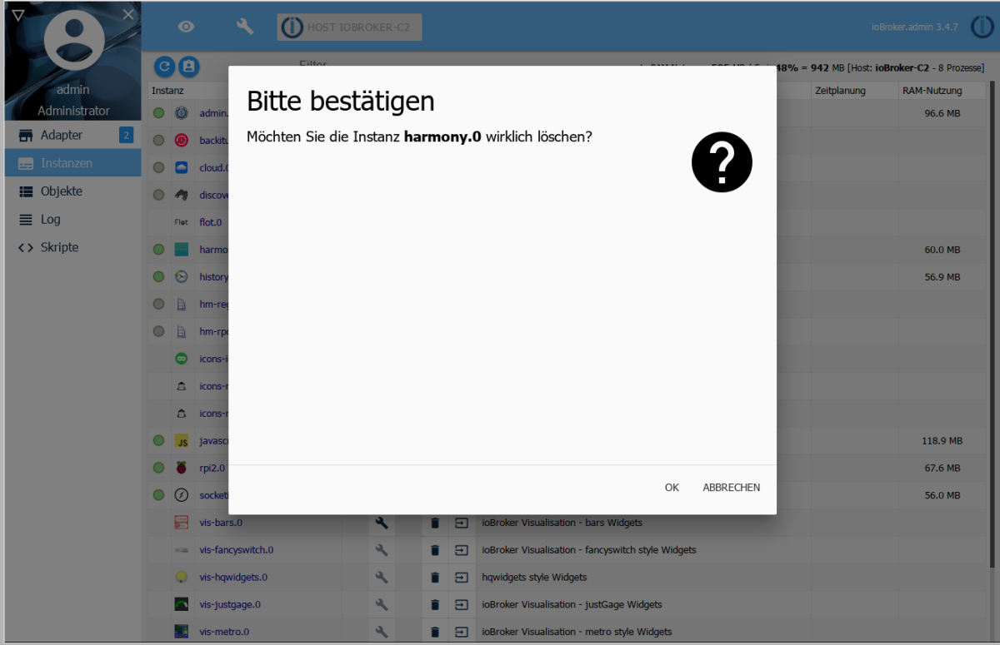
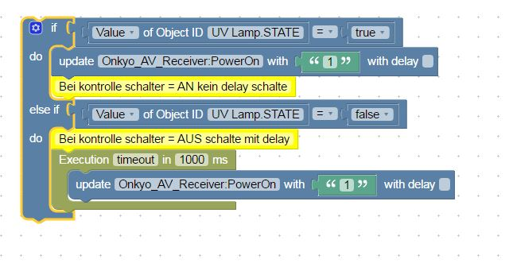

# &emsp;Logitech Harmony-Adapter
Der Logitech Harmony-Adapter ermöglicht die einfache Einbindung eines oder 
auch mehrerer Logitech Harmony Hubs in ein ioBroker-System. 

Mit Hilfe des Logitech Harmony Hubs können eine Vielzahl von Unterhaltungs- und
Smart Home-Geräten gesteuert werden. Mit dem ioBroker lassen sich über den Hub 
Aktivitäten starten und beenden, der Status von Aktivitäten abfragen sowie 
Geräte durch virtuelle Tastendrücke fernsteuern.


 <span style="color:grey">  
*Logitech Harmony Hub mit Harmony Elite Fernbedienung*</span>


<details open><summary>Inhaltsverzeichnis</summary><p>

| Navigation                          |
|-------------------------------------|
| 1  [Steckbrief](#steckbrief)        |  
| 2  [Überblick](#überblick)          |
| 3  [Installation](#installation)    |
| 4  [Konfiguration](#konfiguration)  |
| 5  [Instanz](#instanz)              |
| 6  [Objekte](#objekte)              |
| 7  [Besonderheiten](#besonderheiten)|
| 8  [FAQ](#faq)                      |
| 9  [Beispiele](#beispiele)          |
| 10 [Deinstallation](#deinstallation)|
| 11 [Links](#links)                  |
| 12 [Historie](#historie)            |
</p></details>


<a name="steckbrief"/>

## Steckbrief
> Achtung! Die folgende Tabelle dient nur als Beispiel. Sie wird vom 
  Dokumentengenerator dynamisch erzeugt und an dieser Stelle eingefügt.
  Je nach den ausgewählten Feldern sind die Datenquellen z.B. `frontmatter`,
  `io-package.json` und `package.json` des jeweilgen Adapters.
  Eventuell kann der Steckbrief auch an einer anderen Stelle der Dokumentation
  plaziert werden.

|                         |                                         |
|-------------------------|:---------------------------------------:|
| Stand der Doku          | 29.07.2018                              |
| aktuelle Version stable | ![stable][logo]                         |
| aktuelle Version latest | ![latest][logo]                         | 
| OS                      | Linux, Windows; OS X                    |
| node-Version            | >= 4.x                                  |
| Entwickler              | Pmant                                   |
| Github                  | LINK                                    |
| Lizenz                  | MIT                                     |
| Kategorie               | Multimedia                              |
| Keywords                | `harmony` `hub` `logitech` `home automation`             |
| Abhängigkeiten          | `harmonyhubjs-client` `harmonyhubjs-discover` `semaphore`|          

ioBroker",
      "harmony",
      "hub",
      "logitech",
      "home automation"

<a name="überblick"/>

## Überblick

### Logitech Harmony Hub
Logitech Harmony ist kompatibel mit mehr als 270.000 Entertainment- und Smart 
Home-Geräten. Dazu gehören Fernseher und Kabelboxen, Disc-Player und Spielkonsolen 
bis hin zu AV-Receivern und Streaming-Media-Playern sowie intelligente Beleuchtung,
Schlösser, Thermostate und vieles mehr.

Mit Logitech Harmony kann man Programme wechseln, die Lautstärke regulieren, 
Favoriten festlegen sowie Beleuchtung und anderer Smart-Geräte steuern. Das Highlight
des Systems ist das Erstellen von Aktionen zur Steuerung von mehreren Geräten mit nur
einem Tastendruck.

1. Der Logitech Harmony Hub verbindet sich mit dem Heimnetzwerk über WLAN. 
2. Harmony Hubs haben keinen Ethernet-Anschluss.
3. Der Hub unterstützt nur das WLAN 2,4 GHz-Frequenzband. Das 5 GHz-Frequenzband wird 
   nicht unterstützt.
4. Es sollte ein 802.11 g/n-Router verwendet werden. 802.11 a/b wird nicht unterstützt.
5. Als Verschlüsselung für das WLAN wird vom Hub WEP 64/128, WPA Personal und 
   WPA2-AES unterstützt.
6. UPnP muss für Harmony nicht aktiviert sein, damit die Harmony-App den 
   Hub erkennen und mit ihm kommunizieren kann. Hingegen muss es aktiviert sein,
   damit der Hub andere Geräte im Netzwerk erkennt und mit ihnen zusammenarbeitet.
   Das betrifft zum Beispiel Geräte wie Philips hue, Sonos, Nest, Roku oder Smart TVs.
7. Die maximale Geräteanzahl pro Hub beträgt 8 Geräte. 15 Geräte sind möglich, wenn als
   Fernbedienung mindestens ein Harmony Touch oder Ultimate one am Hub registriert ist.
8. Die maximale Anzahl an bevorzugten Kanälen sind 50 pro mobilem Gerät.

### Logitech Harmony Adapter
Der Logitech Harmony-Adapter findet automatisch alle Logitech Harmony-Hubs, die sich 
über eine WLAN-Verbindung zuammen mit dem ioBroker-Server im gleichen Netzwerksubnetz
befinden.

Der Harmony-Hub benötigt für die Kommunikation mit dem Adapter eine ausgezeichnete
Funkverbindung. Ein Accesspoint in unmittelbarer räumlicher Nähe des Hubs wird 
empfohlen.


<a name="voraussetzungen"/>

## Voraussetzungen vor der Installation
Über den ioBroker Adapter für das Logitech Harmony-System lassen sich keine Geräte oder
Aktionen neu anlegen oder verändern. Deshalb ist es erforderlich, dass vor der Nutzung 
des Adapters das Fernbedienungssystem, wie in der Anleitung von Logitech beschrieben, 
eingerichtet ist und mit den gesteuerten Geräten zusammen funktioniert.


<a name="installation"/>

## Installation
Eine Instanz des Adapters wird über die ioBroker Admin-Oberfläche installiert. Die 
ausführliche Anleitung für die dazu notwendigen Installatonschritte finden sie **hier**.

Nach Abschluß der Installation einer Adapterinstanz öffnet sich automatisch 
ein Konfigurationsfenster.


<a name="konfiguration"/>

##  Konfiguration
Der Adapter findet automatisch alle Harmony Hubs, die sich im Subnetz des 
ioBroker-Servers befinden.


<a name="Logitech Harmony adapter settings"/>

### Fenster "Logitech Harmony adapter settings"
<span style="color:grey">  
*Admin Oberfläche*</span>

| Feld         | Beschreibung |                                                                       
|:-------------|:-------------|
|**Hub User**|Für den Fall, dass Sie den Zugang zur Harmony Hub-Konfiguration mit einem Benutzer und einem Kennwort versehen haben, geben Sie bitte hier den Benutzernamen ein. Achten Sie dabei auf die Groß- und Kleinschreibung.|
|**Hub Passwort**|Für den Fall, dass Sie den Zugang zur Harmony Hub-Konfiguration mit einem Benutzer und einem Kennwort versehen haben, geben Sie bitte hier das Kennwort ein. Achten Sie dabei auf die Groß- und Kleinschreibung.|

Die beiden Felder brauchen nur dann ausgefüllt werden, wenn der Hub mit einem Benutzernamen
und einem Passwort gesichert ist.

Nach Abschluß der Konfiguration wird der Konfigurationsdialog mit `SPEICHERN UND SCHLIEßEN`
verlassen. Dadurch efolgt im Anschluß ein Neustart des Adapters.


<a name="instanz"/>

##  Instanzen
Die Installation des Adapters hat im Bereich `Objekte` eine aktive Instanz des 
Logitech Harmony-Hub-Adapters angelegt.

<span style="color:grey">  
*Erste Instanz*</span>

Auf einem ioBroker Server lässt sich immer nur eine Instanz des Logitech 
Harmony-Adapters installieren.

Ob der Adapter aktiviert oder mit dem Logitech Harmony Hub verbunden ist, ist 
an der Farbe des Status-Feldes der Instanz zu erkennen. Zeigt der Mauszeiger
auf das Symbol, werden weitere Detailinformationen angezeigt. 


<a name="objekte"/>

## Objekte des Adapters

Im Bereich `Objekte` werden in einer Baumstruktur alle vom Adapter im Hub 
erkannten Geräte und Aktivitäten aufgelistet. Zusätzlich wird auch noch 
darüber informiert, ob die Kommunikation mit dem Hub reibungslos erfolgt. 

<span style="color:grey">  
*Objekte des Harmony-Adapters*</span>

Die angelegten Objekte und ihre Funktionen sind wie folgt definiert:

Objekt | Bescheibung 
:------|:-----------
**harmony.0**        |Name der ersten *Instanz* des Logitech Harmony-Adapters
&emsp;**Harmony Hub**|Name des *Hubs*
&emsp;&emsp;**Apple TV Generation 3**|Name eines *Geräts*, enthält Gerätefunktionen 
&emsp;&emsp;**Denon AV-Empfänger**|Name eines *Geräts*, enthält Gerätefunktionen 
&emsp;&emsp;**:**|Weitere *Geräte* mit ihren Funktionen
&emsp;&emsp;**activities**|Liste mit allen im Harmony Hub programmierten *Aktivitäten* 
&emsp;&emsp;***hubBlocked***|Zeigt an, ob der Hub gerade beschäftigt ist
&emsp;&emsp;***hubConnected***|Status der Verbindung zwischen Adapter und Hub

### Funktionen
Öffnet man ein Gerät, so erhält man eine Liste mit allen zum Gerät gehörenden
Funktionen. Diese Funktionen sind gerätespezifisch und unterscheiden sich deshalb
bei Geräten unterschiedlichen Typs.

<span style="color:grey">  
*Funktionen eines Geräts*</span>

Jede Funktion löst die entsprechende Reaktion des angesprochenen Geräts aus. Das
kann man testen, in dem man mit dem Mauszeiger die Glocke rechts der Funktion
betätigt. Alternativ kann man mit dem Stiftsymbol auch einen Wert eintragen. 
Werte haben die Einheit `Millisekunden`. Wird ein Wert zwischen 1 und 250ms
eingegeben, wird vom Harmony Hub meist ein einfacher Tastendruck in der 
vorgegeben Länge ausgegeben. Größere Werte als 250ms können zur 
Mehrfachbetätigung der Funktion führen.

### Aktivitäten
Unterhalb von `activities`werden alle am Harmony Hub programmierten Aktivitäten
aufgelistet.

<span style="color:grey">  
*Aktivitäten*</span>

#### Starten
Aktivitäten können gestartet werden, indem man bei der zu startenden Aktivität 
eine Zahl größer als 0 einträgt. Während der Ausführung der Aktivität ändert sich
diese Zahl zuerst nach 1 (=startend) und dann nach 2 (=aktiv).

#### Stoppen
Laufende Aktivitäten können gestoppt werden, wenn man ihren Wert auf 0 setzt.


**Stop:**  

    Set the state 'Instance.Hub_Name.activities.Activity_Name' to 0.
    Alternatively, you can set the hub's status 'Instance.activities.currentStatus' to any number.
    During the activity's exit sequence the status changes from 3 (stopping) to 0 (stopped)

#### Indikatoren
There are two indicators 'Instance.Hub_Name.activity' and 'Instance.Hub_Name.connected'. Both are read-only, changing their values has no effect.

**activities.currentActivity**
Gives you the name of the currently running activity.

**activities.currentStatus**
Gives you the current status of the hub.
- 0 = inactive
- 1 = starting
- 2 = active
- 3 = stopping

**activities.{activity name}**
Status of this activity. Values are the same as above.


#### Geräte
**Send Command**
Set 'Instance.Hub_Name.Device_Name.command' to a number x to send command for x milliseconds.
A value smaller than 250 probably will send the command only once.
After sending the state will be set to 0 again.


    **Funktion**
    
    Instance.Hub_Name.activity zeigt die aktuell gewählte Aktivität an - Nur Lesen
    
    Instance.Hub_Name.connected zeigt an, ob der Hub mit ioBroker verbunden ist - Nur Lesen


<a name="deinstallation"/>

## Deinstallation
> T: Ich bin der Meinung, dass eine Standarddeinstallation eines Adapters in einem 
  zentralen Artikel ausführlich dokumentiert wird. Beim Adapter wird (immer) 
  auf diesen zentralen Artikel verwiesen. Nur Abweichungen vom Standardverfahren 
  werden hier dokumentiert.

sollte die Instanz wieder entfernt werden sollen wird diese über das zugeordnete Mülleimer-Icon 
in der Rubrik Instanzen entfernt


Es erscheint eine Sicherheitsabfrage, die mit ***OK*** bestätigt werden muss



Anschließend erscheint wieder ein Fenster, dass die Abarbeitung der Deinstallationsbefehle zeigt


Bei dieser Deinstallation werden alle zu der Instanz gehörenden Objekte vollständig entfernt.

Sollten die Installationsdateien vollständig von dem Host gelöscht werden, muss dies über das Mülleimer-Icon 
in der Kachel des Harmony-Adapters in der Rubrik Adapter geschehen.


<a name="besonderheiten"/>

## Besonderheiten
Backup  
Multihost  
History  
Performance


<a name="faq"/>

## FAQ
>Im Forum nach häufig auftretenden Fragen suchen und hier Referenzantwort geben

1. Hub wird nicht gefunden  
   Lösung:

2. Verbindung zum Hub wird immer wieder unterbrochen  
   Lösung:

3. Fehler 500 oder Polling zu schnell  
   Lösung:


<a name="beispiele"/>

## Beispiele

### JavaScript

```javascript
if (getState("hm-rpc.0.MEQ01234567.2.STATE").val == true) {
  setState("harmony.0.Harmony Hub.Denon AV-Empfänger.PowerOn"/*Denon AV-Empfänger:PowerOn*/, '1', true);
  // Bei Kontrolle Schalter == AN keine Verzögerung Schalter
} else if (getState("hm-rpc.0.MEQ01234567.2.STATE").val == false) {
  // Bei Kontrolle Schalter == AUS schalte mit Verzögerung
  var timeout = setTimeout(function () {
    setState("harmony.0.Harmony Hub.Denon AV-Empfänger.PowerOn"/*Denon AV-Empfängerr:PowerOn*/, '1', true);
  }, 1000);
}
```

### Blockly
<span style="color:grey">  
*Blockly*</span>

[Quelltext][blockly]

### Node-Red
> zugehörige node-red-Elemente
> Beispiele
> Exporte zum Weiterverwenden

### vis
> zugehörige vis-Elemente
> Beispiele
> Exporte zum Weiterverwenden
> Code-Fragmente


<a name="linksn"/>

## Links
> Referenzen auf andere Dokumente im ioBroker-Portal
> Weblinks z.B. zum Hersteller
> GitHub-Links
* Herstellerseite https://www.logitech.com/de-de/product/harmony-hub (20.07.2018)


<a name="historie"/>

## Historie
> Der folgende Text dient nur als Platzhalter. Die Historie wird  
  vom Dokumentengenerator dynamisch erzeugt und hier eingefügt. Datenquelle
  ist io-package.json -> common.news in der jeweiligen Doku-Sprache

| Version | Änderung                                  |
|:-------:|:------------------------------------------|
|0.9.1    |Fix für problematische Zeichen             |
|0.7.1    |Bug fixes                                  |
|0.7.0    |Unterstützung für mehrere Hubs hinzugefügt |
|0.6.2    |falscher Port korrigiert                   |
|0.1.0    |Initialer commit                           |   


[logo]: https://badge.fury.io/js/svgo.svg "npm logo"
[blockly]: media/a_harmony_blockly.xml "Blockly"