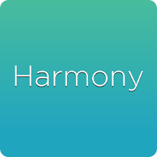
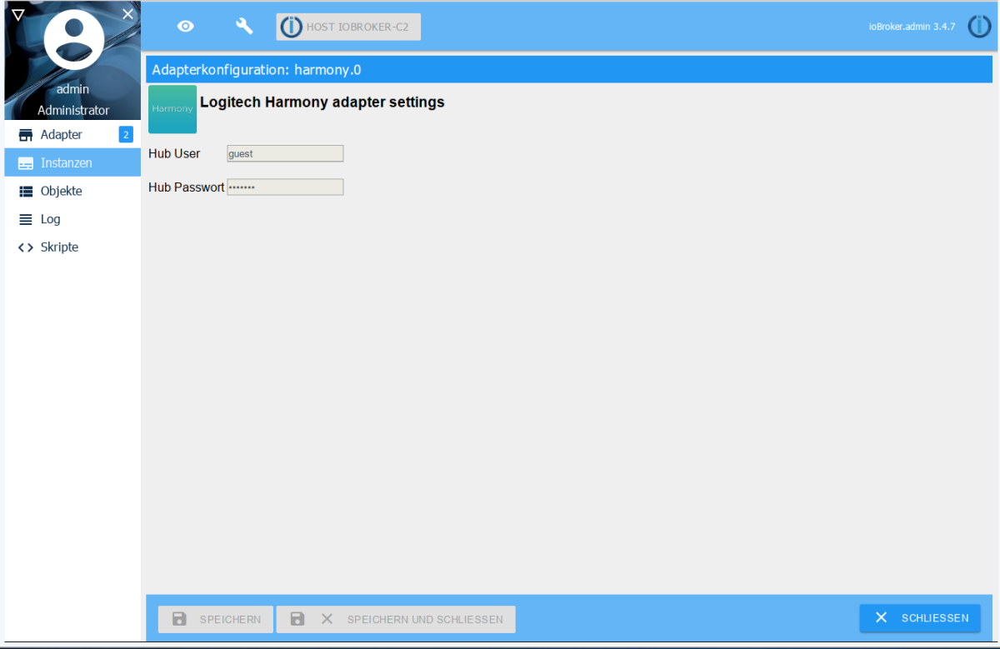

# &emsp;Harmony
Der Harmony-Adapter ermöglicht die einfache Einbindung des Logitech Harmony 
Hubs mit all seinen Möglichkeiten in das ioBroker-System. Mit dem Logitech
Harmony Hub können über eine passende Fernbedienung oder eine App eine Vielzahl
von Unterhaltungs- und Smart Home-Geräten gesteuert werden. Man kann Programme
wechseln, die Lautstärke regulieren, Favoriten festlegen sowie Beleuchtung und
anderer Smart-Geräte steuern. Das Highlight des Systems ist das Erstellen von
Aktionen zur Steuerung von mehreren Geräten mit nur einem Tastendruck.

Der Harmony Hub ist kompatibel mit mehr als 270.000 Entertainment- und
Smart Home-Geräten. Dazu gehören Fernseher und Kabelboxen, Disc-Player und
Spielkonsolen bis hin zu AV-Receivern und Streaming-Media-Playern sowie
intelligente Beleuchtung, Schlösser, Thermostate und vieles mehr.

Mit dem ioBroker kann man über den Harmony Hub Aktivitäten starten und beenden, 
deren Status abfragen sowie Geräte durch virtuelle Tastendrücke fernsteuern.

 *Logitech Harmony Hub mit Harmony Elite Fernbedienung*

## Inhaltsverzeichnis

| Navigation                          |
|-------------------------------------|
| 1  [Steckbrief](#steckbrief)        |  
| 2  [Anmerkungen](#anmerkungen)      |
| 3  [Installation](#installation)    |
| 4  [Konfiguration](#konfiguration)  |
| 5  [Objekte](#objekte)              |
| 6  [States](#states)                |
| 7  [Deinstallation](#deinstallation)|
| 8  [Besonderheiten](#besonderheiten)|
| 9  [FAQ](#faq)                      |
| 10 [Beispiele](#beispiele)          |
| 11 [Informationen](#informationen)  |
| 12 [Historie](#historie)  |

<a name="steckbrief"/>

## Steckbrief
>Achtung! Die folgende Tabelle dient nur als Beispiel. Sie wird vom 
Dokumentengenerator dynamisch erzeugt und an dieser Stelle eingefügt. 
Datenquellen sind `frontmatter`, `io-package.json` und `package.jason`.

|                         |                          |
|-------------------------|:------------------------:|
| Stand der Doku          | 29.07.2018               |
| aktuelle Version stable | link und logo npm        |
| aktuelle Version latest | link und logo npm        | 
| OS                      | Linux, Windows; OS X     |
| node-Version            | >= 4.x                   |
| Entwickler              | Pmant                    |
| Github                  | LINK                     |
| Lizenz                  | MIT                      |
| Kategorie               | Multimedia               |
| Keywords                | Logitech, Fernbedienung  |

<a name="anmerkungen"/>

## Anmerkungen

1. Der Logitech Harmony Hub verbinden sich mit Ihrem Heimnetzwerk über WLAN. 
2. Harmony Hubs unterstützen keine Ethernet-Kabelverbindungen.
3. Das WLAN 2,4 GHz-Frequenzband wird vom Hub unterstützt. Das 5 
   GHz-Frequenzband wird nicht unterstützt.
5. Bitte einen 802.11 g/n-Router verwenden. 802.11 a/b wird nicht unterstützt.
6. Als Verschlüsselung wird vom Hub WEP 64/128, WPA Personal und WPA2-AES unterstützt.
7. UPnP muss für die Harmony nicht aktiviert sein, damit die Harmony-App den 
   Hub erkennen und mit ihm interagieren kann. Hingegen muss es aktiviert sein, 
   damit der Hub andere Geräte im Netzwerk erkennen und mit ihnen zusammenarbeiten 
   kann, beispielsweise Philips hue, Sonos, Nest, Roku oder Smart TVs.
8. Maximale Geräteanzahl: 8 Geräte
9. Maximale Anzahl an bevorzugten Kanälen: 50 bevorzugte Kanäle pro mobiles Gerät.

<a name="installation"/>

## Installation
> Ich bin der Meinung, dass eine Standardinstallation eines Adapters in einem Artikel
  ausführlich dokumenteirt wird. Hier wird (immer) auf diesen Artikel verwiesen. 
  Nur Abweichungen vom Standardverfahren werden hier dokumentiert.

Eine Instanz des Adapters wird über den Admin installiert.

Dazu wird unter der Rubrik "Adapter" die Kachel für den Harmony Adapter gesucht.

Auf dieser Kachel wird auf das Icon für die erweiterten Einstellungen geklickt.

  
*Testbild*

und in diesen Einstellungen auf das (+) zum Erstellen einer Instanz.

Es öffnet sich ein Installationsfenster in dem der Fortschritt der Installation
durch die Anzeige der ablaufenden Befehlsfolgen angezeigt wird.

Nach vollendeter Installation schließt sich das Fenster standardmäßig von selbst.

Danach öffnet sich das Konfigurationsfenster der Instanz.

<a name="konfiguration"/>

##  Konfiguration

Der Adapter findet automatisch die harmony Hubs im lokalen Netzwerk

Die angezeigten Felder müssen nur ausgefüllt werden, wenn der Hub mit Usernamen und
Passwort gesichert ist.

Jetzt kann man das Konfigurationsfenster schließen.

<a name="objekte"/>

## Angelegte Objekte und ihre Bedeutung

in der Rubrik wurde eine neue Gruppe für die Instanz (üblicherweise harmony.0) angelegt.

Die Struktur der angelegten Objekte und ihre Funktionen sind wie folgt:

**Instanz**

mehrere Instanzen sind bei diesem Adapter nicht erlaubt

   **Hub Name**
   
   Name des Hubs
   
   
      **Gerät**
      
      Hier erscheinen alle am Harmony-Hub angelernten Geräte
      
         
         **Funktion**
         
         Die zur Verfügung stehenden Funktionen hängen von dem entsprechenden Gerät ab
         
      
      **Aktivität**
      
      Hier erscheinen alle am Harmony Hub programmierten Aktivitäten
      
      
         **Funktion**
         
         Instance.Hub_Name.activity zeigt die aktuell gewählte Aktivität an - Nur Lesen
         
         Instance.Hub_Name.connected zeigt an, ob der Hub mit ioBroker verbunden ist - Nur Lesen

<a name="states"/>

#### Bedeutung der States
(in die Struktur oben einbinden!)

##### activities
**Start:**
Set the status state 'Instance.Hub_Name.activities.Activity_Name' to a Number greater than 0.
During the activity's startup sequence the status changes from 1 (startup) to 2(running)

**Stop:**
Set the state 'Instance.Hub_Name.activities.Activity_Name' to 0.
Alternatively, you can set the hub's status 'Instance.activities.currentStatus' to any number.
During the activity's exit sequence the status changes from 3 (stopping) to 0 (stopped)

#### Indikatoren
There are two indicators 'Instance.Hub_Name.activity' and 'Instance.Hub_Name.connected'. Both are read-only, changing their values has no effect.

**hubConnected**
Tells you whether the adapter is successfully connected to the hub.

**.hubBlocked**
Is set to true if Hub is busy starting/stopping activities or sending commands.

**activities.currentActivity**
Gives you the name of the currently running activity.

**activities.currentStatus**
Gives you the current status of the hub.
- 0 = inactive
- 1 = starting
- 2 = active
- 3 = stopping

**activities.{activity name}**
Status of this activity. Values are the same as above.

#### Geräte
**Send Command**
Set 'Instance.Hub_Name.Device_Name.command' to a number x to send command for x milliseconds.
A value smaller than 250 probably will send the command only once.
After sending the state will be set to 0 again.

<a name="deinstallation"/>

## Deinstallation
sollte die Instanz wieder entfernt werden sollen wird diese über das zugeordnete Mülleimer-Icon 
in der Rubrik Instanzen entfernt

Es erscheint eine Sicherheitsabfrage, die mit ***OK*** bestätigt werden muss

Anschließend erscheint wieder ein Fenster, dass die Abarbeitung der Deinstallationsbefehle zeigt

Bei dieser Deinstallation werden alle zu der Instanz gehörenden Objekte vollständig entfernt.

Sollten die Installationsdateien vollständig von dem Host gelöscht werden, muss dies über das Mülleimer-Icon 
in der Kachel des Harmony-Adapters in der Rubrik Adapter geschehen.

<a name="besonderheiten"/>

## Besonderheiten
Backup  
Multihost  
History  
Performance

<a name="faq"/>

## FAQ

1. Hub wird nicht gefunden  
   Lösung:

2. Verbindung zum Hub wird immer wieder unterbrochen  
   Lösung:

3. Fehler 500 oder Polling zu schnell  
   Lösung:

<a name="beispiele"/>

## Beispiele

### JavaScript
Lorem ipsum

### Blockly
Lorem ipsum

### Node-Red
Lorem ipsum

### vis
Lorem ipsum

<a name="informationen"/>

## Weiterführende Informationen
Lorem ipsum

<a name="historie"/>

## Historie
>Achtung! Der folgende Text dient nur als Platzhalter. Die Historie wird 
vom Dokumentengenerator dynamisch erzeugt und hier eingefügt. Datenquelle
ist io-package.json -> common.news in der jeweiligen Doku-Sprache

| Version | Änderung                                  |
|:-------:|:------------------------------------------|
|0.9.1    |Fix für problematische Zeichen             |
|0.7.1    |Bug fixes                                  |
|0.7.0    |Unterstützung für mehrere Hubs hinzugefügt |
|0.6.2    |falscher Port korrigiert                   |
|0.1.0    |Initialer commit                           |   
