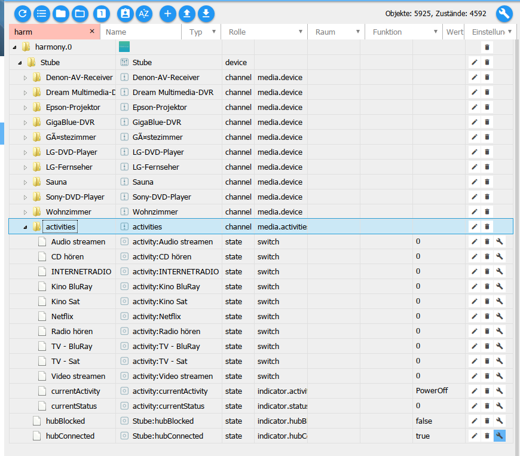

# Harmony

## Vorbemerkung
Der Logitech Harmony Hub ermöglicht über eine passende Fernbedienung oder App
eine Vielzahl von Unterhaltungs- und Smart Home-Geräten zu steuern.
Damit kann man Programme wechseln, die Lautstärke regulieren bis hin zum
Programmieren von Favoriten, Steuern der Beleuchtung und anderer Smart-Geräte. 
Das Highlight des Systems ist das Erstellen von Aktionen zur Steuerung von mehreren
Geräten mit nur einem Tastendruck.

Der Harmony Hub ist kompatibel mit mehr als 270.000 Entertainment- und
Smart Home-Geräten. Von Fernsehern und Kabelboxen über Disc-Player und
Spielkonsolen bis hin zu AV-Receivern und Streaming-Media-Playern sowie
intelligente Beleuchtung, Schlösser, Thermostate und mehr –
Harmony Hub ist mit nahezu allen Geräten kompatibel.

## Der Adapter

Dieser Adapter ermöglicht die Einbindung des Logitech Harmony Hubs mit all
seinen Möglichkeiten in das ioBroker-System. Der ioBroker kann über den
Harmony Hub Aktivitäten starten und beenden, Geräte durch virtuelle Tastendrücke
fernsteuern sowie den Status von Aktivitäten abfragen.

> Hier netter Screenshot zur Motivation, z.B. aus VIS oder oder oder

### Ich bin ein Inhaltsverzeichnis oder so etwas ähnliches
| Tables        | Are           | Cool  |
| ------------- |:-------------:| -----:|
| col 3 is      | right-aligned | $1600 |
| col 2 is      | centered      |   $12 |
| zebra stripes | are neat      |    $1 |

## Steckbrief
|  |  |
| --- | :---: |
| aktuelle Version stable| link und logo npm |
| aktuelle Version latest | link und logo npm      |
| OS| Linux, Windows; OS X (hoffe ich) |
| node-Version | >= 4.x |
| Entwickler | Pmant |
| Lizenz | MIT |
| Github | LINK |
| Keywords | Logitech, Fernbedienung |
| Kategorie | Multimedia |
| Stand der Doku | 28.07.2018 |

## Installation

Eine Instanz des Adapters wird über den Admin installiert.

##  Konfiguration

Der Adapter findet automatisch die harmony Hubs im lokalen Netzwerk
Jede Menge Bilder
Beschreibung jedes Formularfeldes

## Angelegte Objekte und ihre Bedeutung

Die Struktur und ihre Funktionen sind wie folgt:

**Instanz**

mehrere Instanzen sind bei diesem Adapter nicht erlaubt

   **Hub Name**
   
   Name des Hubs
   
   
      **Gerät**
      
      Hier erscheinen alle am Harmony-Hub angelernten Geräte
      
         
         **Funktion**
         
         Die zur Verfügung stehenden Funktionen hängen von dem entsprechenden Gerät ab
         
      
      **Aktivität**
      
      Hier erscheinen alle am Harmony Hub programmierten Aktivitäten
      
      
         **Funktion**
         
         Instance.Hub_Name.activity zeigt die aktuell gewählte Aktivität an - Nur Lesen
         
         Instance.Hub_Name.connected zeigt an, ob der Hub mit ioBroker verbunden ist - Nur Lesen

#### Bedeutung der States
(in die Struktur oben einbinden!)

##### activities
**Start:**
Set the status state 'Instance.Hub_Name.activities.Activity_Name' to a Number greater than 0.
During the activity's startup sequence the status changes from 1 (startup) to 2(running)

**Stop:**
Set the state 'Instance.Hub_Name.activities.Activity_Name' to 0.
Alternatively, you can set the hub's status 'Instance.activities.currentStatus' to any number.
During the activity's exit sequence the status changes from 3 (stopping) to 0 (stopped)

#### Indikatoren
There are two indicators 'Instance.Hub_Name.activity' and 'Instance.Hub_Name.connected'. Both are read-only, changing their values has no effect.

**hubConnected**
Tells you whether the adapter is successfully connected to the hub.
> Beispielcode

**.hubBlocked**
Is set to true if Hub is busy starting/stopping activities or sending commands.
> Beispielcode

**activities.currentActivity**
Gives you the name of the currently running activity.
> Beispielcode

**activities.currentStatus**
Gives you the current status of the hub.
- 0 = inactive
- 1 = starting
- 2 = active
- 3 = stopping
> Beispielcode

**activities.{activity name}**
Status of this activity. Values are the same as above.
> Beispielcode

#### Geräte
**Send Command**
Set 'Instance.Hub_Name.Device_Name.command' to a number x to send command for x milliseconds.
A value smaller than 250 probably will send the command only once.
After sending the state will be set to 0 again.

## Beispiele/Demo
Lorem ipsum

## Besonderheiten
Backup
Multihost
History
Performance

## Bekannte Probleme

* Hub wird nicht gefunden
  Lösung:

* Verbindung zum Hub wird immer wieder unterbrochen
  Lösung:

* Fehler 500 oder Polling zu schnell
  Lösung:

## Einbinden der States

### Blockly
Lorem ipsum

### Node-Red
Lorem ipsum

### vis
Lorem ipsum

### History
Lorem ipsum

## Links
Irgendwo kommen auch noch Links zu GitHub (Entwicklerbereich?) und
externen Ressourcen? Aber bitte nicht gleich am Doku-Anfang, eher am Ende.
Zuerst die leichte Kost.

## Entwicklerbereich

----------

