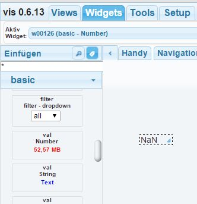
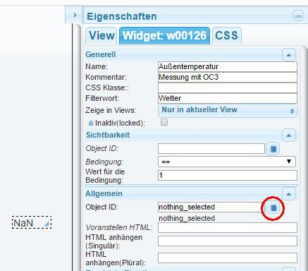
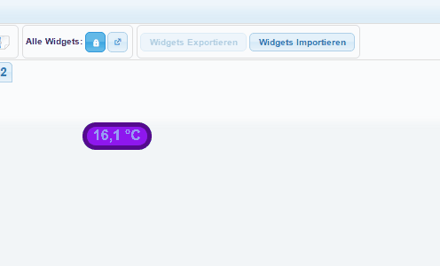

# Einstieg in ioBroker mit homematic

## Übersicht

Nachdem die grundsätzliche [Installation](http://www.iobroker.net/?page_id=44) von ioBroker fertiggestellt ist, muss auf jeden Fall ein [hm-rega Adapter](http://www.iobroker.net/?page_id=146) für die Klarnamen der Geräte, die Programme und die Systemvariablen. Eine [Instanz](http://www.iobroker.net/?page_id=14) des [rpc-Adapters](http://www.iobroker.net/?page_id=148) für die Werte der Datenpunkte wird automatisch mit einer Instanz des hm-rega Adapters angelegt. Für jede weitere verwendete Datenquelle (Funk, Wired, CuxD) muss auch eine weitere Instanz des rpc-Adapters  angelegt werden.

Je nachdem, was mit diesen Daten geschehen soll (Visualisierung/Bedienung; Programme auslösen, Historie der Datenpunkte) benötigt man außerdem je eine Instanz von den entsprechenden Adapter.

### Visualisierung und Bedienung

Ein solcher "View" wird mit dem [vis-Adapter](http://www.iobroker.net/?page_id=188) erstellt. Dieser Adapter ist sehr umfangreich und hat daher eine eigene Rubrik in dieser Doku.

Auf einer frei wählbaren Fläche, deren Größe an das gewünschte Ausgabegerät angepasst werden kann, werden mithilfe von Drag & Drop die "Widgets", mit denen Bedienung und Darstellung von Zuständen und Messwerten erfolgen, auf diese Arbeitsfläche gezogen und dort nach eigenen Wünschen positioniert.

Jedes Widget hat eine Vielzahl von Einstellungsmöglichkeiten, die man jedoch nicht bereits zu Anfang verwenden muss. Lediglich der zu verknüpfende Datenpunkt muss über ein einfach zu bedienendes Explorermenü ausgewählt werden.

### Programmierung

Die Programmierung von z.B. ereignisbasierten Aktionen erfolgt über [JavaScript](http://www.iobroker.net/?page_id=156). Für Anwender, die JavaScript nicht mächtig sind ist ein einfacher grafischer Editor [geplant](http://www.scriptgui.info), für den keinerlei JavaScript-Kenntnisse erforderlich sind.

Außerdem steht mit dem [node-red Adapter](http://www.iobroker.net/?page_id=166) eine ebenfalls grafische Bedienoberfläche zur Verfügung mit immensen Fähigkeiten auch Daten aus nahezu beliebigen externen Quellen auszuwerten oder in externe Ziele zu schreiben.

### Historische Daten

Mit dem [History-Adapter](http://www.iobroker.net/?page_id=144) können selektiv einzelne Datenpunkte geloggt werden -auf Wunsch auch nur bei Änderung- und mit [rickshaw](http://www.iobroker.net/?page_id=176) oder [flot](http://www.iobroker.net/?page_id=198) grafisch dargestellt werden.

## Tutorial

In diesem Tutorial soll die Einbindung von Homematic in ioBroker und der Aufbau des oben gezeigten Views zur Visualisierung und Bedienung einer einfachen Poolsteuerung erklärt werden.

#### Vorgeschichte

Die Grundlage der Steuerung ergibt sich u.a. aus der baulichen Lage

Der Pool steht im Garten, die Heizung liegt auf der Garage, die etwas versetzt neben dem Haus steht, so dass sie erst dann voll von der Sonne beschienen wird, wenn diese bei einem Azimut von 130° steht.

Um Strom zu sparen soll die Umwälzpumpe erst laufen, wenn dies der Fall ist, da es sonst sogar zur Abkühlung des Poolwassers kommt.

Die auf der CCU dahinterstehende Logik besteht aus folgenden Elementen:

*   Sonnenstand
*   Vorlauf- und Rücklauftemperatur der Poolheizung
*   Temperatur des Poolwassers
*   Messung der Sonneneinstrahlung durch zwei Hitzesensoren (hinten und vorne), die auch für die Beschattungssteuerung der Rollläden benutzt werden.
*   Aktor zum Schalten der Poolpumpe
*   Systemvariable "Poolpumpe_an", die um 4 Minuten verzögert angeschaltet wird um dafür zu sorgen, dass die Pumpe nicht sofort wieder ausschaltet, bevor der Temperaturdifferenzsensor einen aktuellen Wert der Vorlauf- und Rücklauftemperatur gesendet hat. Sollte die Temperaturdifferenz auf 0,2 °C fallen schaltet die Pumpe sofort und die Variable verzögert um 10 Minuten aus, um dem Sonnenkollektor Zeit zu geben sich wieder aufzuheizen, bevor die Pumpe wieder anschaltet.

#### Aufsetzen des Systems

Als erstes muss ioBroker [nach dieser Anleitung](http://www.iobroker.net/?page_id=44) installiert werden. Hier wird davon ausgegangen, dass dies auf einem ARM-Einplatinencomputer geschieht.

für einige Einplatinencomputer befinden sich [im Downloadbereich](http://www.iobroker.net/?page_id=57&lang=de#installation) fertige Images mit Betriebssystem und einer vollständigen ioBroker-Installation. Es müssen nur noch die gewünschten Instanzen angelegt und konfiguriert werden.

Anschließend ruft man über <IPdesRasPi>:8081 den Administrator von ioBroker auf. Beim ersten mal öffnet sich eine Fenster mit der Lizenzvereinbarung. Dieses bitte bestätigen.

Danach befindet man sich auf dieser Seite:

Diese Liste enthält alle zur Zeit verfügbaren Adapter mit ihrem Entwicklungsstand, erkennbar an der Versionsnummer und der hinterlegten Farbe davon.

Wie man an der Spalte _Installiert_ sieht, sind nur der admin- und der example-Adapter installiert. Um Downloadvolumen zu reduzieren, werden die Dateien von nicht benutzten Adaptern erst einmal nicht auf den RasPi heruntergeladen. Außerdem sieht man hier in den eckigen Klammern, dass bei admin bereits eine Instanz erzeugt wurde. Eine Instanz ist eine installierte Funktionseinheit eines Adapters. Von den meisten Adaptern können beliebig viele Instanzen (mit unterschiedlichen Konfigurationen) genutzt werden.

Für eine Homematic-Installation benötigen wir mindestens je eine Instanz des hm-rega- und des hm-rpc-Adapters.

Um diese [Instanzen zu erzeugen](http://www.iobroker.net/?page_id=14) klicken wir bei dem Homematic ReGaHSS Adapter auf das (+) in der letzten Spalte ganz rechts (im Bild eine Zeile über der markierten):

Die Instanz des ReGa-Adapters und gleichzeitig eine Instanz des hm-rpc-Adapters werden jetzt erzeugt. Die sich öffnenden Fortschrittsfenster schließen automatisch und anschließend erscheinen bei diesen Adaptern ebenfalls zusätzliche Informationen in der Spalte _Installiert_.

Außerdem erscheinen die Instanzen jetzt unter dem Reiter _Instanzen (altes Bild)_. 

Hier müssen die Instanzen von 

1.) [hm-rpc](http://www.iobroker.net/?page_id=148) und 
2.) [hm-rega](img/_page_id_146) noch konfiguriert und aktiviert werden.

Unter dem Reiter _Objekte_ befinden sich jetzt die aus der CCU ausgelesenen Daten. Datenpunkte befinden sich im Ordner hm-rpc.0, Systemvariable im Ordner hm-rega.0.

Die aktuellen Zustände der Daten befindet sich im Reiter _Zustände_.

Ebenso werden jetzt die notwendigen Instanzen der folgenden Adapter installiert:

*   visualisation
*   visualisation - vis
*   visualisation - metro style widgets
*   visualisation - hq-widgets style widgets
*   visualisation - plumb widgets

*   History
*   flot

#### Konfiguration der Adapter

Die Adapter vis, die dazugehörenden Widgets, flot und history selbst müssen nicht konfiguriert werden. Um den Verlauf von Datenpunkten später grafisch darstellen zu können müssen die gewünschten Datenpunkte jedoch vorher mit dem History-Adapter geloggt werden. Dazu müssen die Datenpunkte, die geloggt werden sollen, im Reiter Objekte des admin-Adapters aktiviert werden:

Zum leichteren Auffinden kann man die Tabelle über die Felder oberhalb der Spaltenköpfe filtern. Anschließend klickt man auf das Uhr-Icon des gesuchten Datenpunktes. Ein Konfigurationsfenster öffnet sich:

Hier wird die Checkbox "aktiviert" angehakt. Wenn jeder Wert bei Aktualisierung geloggt werden soll, wird der Haken bei "Nur Änderungen aufzeichnen" entfernt. Anschließend wird noch der Zeitraum, über den die Daten gespeichert werden sollen ausgewählt und dann wird mit Speichern die Konfiguration beendet.

Das History-Icon färbt sich bei aktiven Datenpunkten grün.

Sollte man es geschafft haben die Filterbedingungen so auszuwählen, dass man nur noch Datenpunkte in der Tabelle hat, die geloggt werden sollen, kann man mit dem History-Icon ganz rechts oben alle Datenpunkte auf einmal einstellen.

#### Aufbau des views

Jetzt wird der Editor von vis aufgerufen. Dies geschieht entweder über den Link in der Zeile vis im Reiter Instanzen, oder indem `<IPdesRasPi>:8082/vis/edit.html` in die Adressleiste des Browsers eingegeben wird.

Beim ersten Aufruf wird ein Demoview angelegt. Wir wollen jedoch einen anderen anlegen. Dazu wechseln wir auf den Reiter _View_ und klicken auf das (+) neben dem Viewnamen: 

In dem sich nun öffnenden Feld mit der Bezeichnung neuer Name: geben wir einen aussagekräftigen Namen für den View ein. Hier: _Poolsteuerung_. Dann sichern wir die Änderungen mit einem Klick auf das Haken-Icon. Eine neue leere Arbeitsfläche erscheint.

Wir wechseln auf den Reiter Tools und stellen links oben eine Auflösung für den View, passend zu dem geplanten Ausgabegerät ein. Es stehen eine Vielzahl von Auflösungen für gängige Tablets und Handys zur Verfügung, sowie die Option _anwenderdefiniert_. Wir wählen _iPad - Landscape_.

Auf der Arbeitsfläche werden jetzt Linien zur Begrenzung der ausgewählten Auflösung angezeigt. Sollte die Fläche auf dem Bildschirm kleiner, als die gewählte Auflösung, z.B bei _FullHD - Landscape_ sein, erscheinen horizontale und vertikale Scrollbalken.

Nun erstellen wir das erste Widget:

zur Anzeige der Temperaturen verwenden wir das Widget _basic - number_. Dazu wechseln wir auf den Reiter _Widget_ und filtern die Widget-Sidebar entweder nach dem Begriff Number, oder darunter nach dem Widget-set Basic.

 Das Widget ziehen wir auf die Arbeitsfläche

Dadurch dass das widget markiert ist passt sich auf der rechten Seite des Editors die CSS-Sidebar entsprechend an. Dort können die [Eigenschaften des Widgets](img/_page_id_1048_lang=de#Grundeinstellungen) eingestellt werden. Die Einstellungen für die Eigenschaften sind in vielen Bereichen für alle Widgets gleich aufgebaut, lediglich der 3\. Block _Allgemein_ ist widgetspezifisch.

In dem obersten Block _Generell_ werden Informationen zu dem Widget eingegeben, in dem 2\. Block _Sichtbarkeit_ können Bedingungen eingegeben werden, wann das widget auf dem View zu sehen sein soll. Hier geben wir erst einmal nichts ein. Im Block _Allgemein_ befindet sich mit _Object ID_ der wichtigste Punkt zur Einstellung. Hier wird der Datenpunkt eingetragen, der durch das Widget angezeigt oder gesteuert werden soll. Dazu klickt man auf den select Button und ein Datenpunkt-Explorer öffnet sich:

Hier kann man zur besseren Übersicht ebenfalls wieder filtern. Im Ordner hm-rega befinden sich Systemvariable und Programme, im Ordner hm-rpc die Datenpunkte. Diese Ordnerstruktur muss solange aufgeklappt werden, bis der eigentliche Datenpunkt angewählt werden kann (Gerät oder Kanal reichen nicht). Durch Anklicken von _Auswählen_ wird die ID übernommen. Der Wert des Datenpunktes wird jetzt in dem Widget angezeigt.

Jetzt wollen wir das Widget ein wenig designen. Dies geschieht mit den Parametern in der CSS-Sidebar. Zuerst wird die Anzeige des Messwerts angepasst:

Man kann dem eigentlichen Wert etwas voranstellen (z.B. "Außentemperatur"), und etwas anhängen (z.B. die Einheit, wobei man dort auch noch zwischen Einheiten mit verschienen Begriffen im Singular (Wert=1, also "Auto") und Plural (>1, also "Autos") unterscheiden kann. Hier kann man dem Wert auch komplexere Anweisungen in HTML übergeben.

In den erweiterten Einstellungen kann man noch die Anzahl Nachkommastellen einstellen, und ob ein Dezimalpunkt, oder ein Dezimalkomma gesetzt werden soll.

Zusätzlich kann man vordefinierte CSS-Klassen für die Formatierung des Widgets benutzen, die entsprechend geändert werden, wenn der Wert von true auf false (also nur bei bool) schaltet.

Die nach dem Trennbalken erscheinenden Einstellmöglichkeiten sind bei allen Widgets gleich, weshalb sie nur einmal beschrieben werden.

Unter _CSS Allgemein_ stehen zuerst die Position und Größe des Widgets. Die Größe kann man direkt am Widget durch Aufziehen an der unteren rechten Ecke und die Position durch Verschieben einstellen. Alternativ können hier die Werte angepasst werden.

Ein sehr wichtiger Punkt ist der _z-Index_. Hier wird die Lage des Widget in der Tiefe des Views festgelegt. Ein Wert 0 entspricht der Lage auf der Arbeitsfläche, ein negativer Wert liegt dahinter, und je höher der Wert ist, desto weiter auf den anderen liegt das aktuelle Widget. Wird kein Wert angegeben, wird dies automatisch geregelt.

Im Block _CSS Font & Text_ werden die Parameter für die Schrift eingegeben. Die Schriftfarbe kann man für die einfachen Farben mit "red", "blue" usw. eingeben, als rgb(120,50,80), rgba(120,50,80,40) oder aber in HEX. Zur Erleichterung gibt es einen Colorpicker, der über das Icon rechts neben dem Feld aufgerufen werden kann. Die Textausrichtung wird bei _text-align_ eingegeben, weitere Zeichenssatzattribute in den darunterliegenden Feldern. Für die Schriftgröße gibt es vordefinierte Größen, es kann aber auch die Schriftgröße in px definiert werden.

Der nächste Block _CSS Hintergrund_ legt die Parameter für den Hintergrund des Widgets fest. Der wohl wichtigste Wert ist die Farbe:

Mit weiteren Parametern werden die Ränder des Widgets definiert. Die Breite des Randes, die Ausführung der Linie (meistens solid) sowie die Farbe werden gesetzt. Soll das Widget noch abgerundete Ecken bekommen wird noch ein Wert für den Radius eingestellt. Ist der eingestellte Radius größer als die Hälfte der Kantenlänge wird das Widget rund.

In dem Block _Schatten und Abstand_, wird noch der Abstand der Schrift zum Rand bestimmt. Dieses geht gleichseitig, oder für jeden Rand einzeln. Die erste Zeile hat Vorrang.

Da für den View 6 Temperaturanzeigen gebraucht werden, wird das Widget angeklickt und mit Strg-C kopiert  - am oberen Bildrand erscheint die Meldung, dass das Widget in die Zwischenablage kopiert wurde. Anschließend werden mit 5x Strg-V 5 Kopien erzeugt.

Diese Widgets werden jetzt an die gewünschten Positionen verschoben und die entsprechende Beschreibung sowie die Objekt-ID des gewünschten Datenpunktes angepasst.

##  Reminders - To do!

*   Welche Adapter wähle ich mindestens aus - **wie sehe ich, dass das erfolgreich war???**
*   kurzer Check der Objektliste
*   wie findet man Geräte, Programme, Systemvariablen
*   was, wenn ich in Homematic ein Gerät neu anlege/umbenenne/lösche
*   Visualisierung
*   einfache Seite gestalten - kein Schnickschnack, eine Auflösung
*   statische Überschrift
*   Fenstersensor Status anzeigen und einfärben (z.B. [viewtopic.php?f=30&t=1048](http://forum.iobroker.net/viewtopic.php?f=30&t=1048))
*   Heizungsstatus
*   Heizung an/aus Aktor
*   Anzeige/Ändern einer Systemvariable
*   pimp my site 
*   Hintergrundbild
*   ein paar Beispiele für die CSS Eigenschaften wie Schriftart, Schriftgröße
*   Starte Program auf Homematic
*   Wie würde dasselbe Program auf ioBroker aussehen? Wie bindet man js auf ioBroker ein (hier hänge ich selber gerade  )
*   fortgeschrittene Themen
*   Unterstützung verschiedene Auflösungen
*   ioBroker von außerhalb des LAN
*   Pushover Integration
*   NodeRED Integration