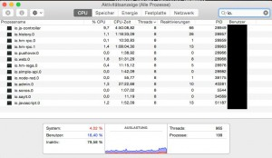

# Installation unter OS X

## Installation

**Voraussetzung**: [node](http://nodejs.org)[

 ist bereits bei installiert

1.  Download ioBroker.js-controller-master.zip (rechts auf den Button Download zip klicken)
2.  einen Ordner "iobroker" an einem beliebigen Ort erstellen (z.B. unter _/User/Dokumente_)
3.  das .zip-file in diesen Ordner kopieren
4.  Im Terminal in den soeben erstellten Ordner (z.B. "ioBroker") gehen `cd /iobroker`. **Tipp**: Im Terminal `cd` eintippen und eben erstellten Ordner mir der Maus ins Terminalfenster ziehen. Dann Return drücken.
5.  ioBroker installieren `npm install iobroker --unsafe-perm`
6.  im Terminal in das Unterverzeichnis iobroker.js-controller wechseln `cd node_modules/iobroker.js-controller`
7.  Die Datei iobroker ausführbar machen `chmod +x iobroker`
8.  Den Controller starten `node controller.js`
9.  Nach der Installation den Browser öffnen und in der Adressleiste `http://localhost:8081` eingeben

**Hinweis**: node controller kann im Terminal mit ctrl+c abgebrochen werden.

* * *

## Wartung

### Aktivitätsanzeige

Alle iobroker Prozesse und ihren Ressourcenverbrauch kann man leicht mit der _Aktivitätsanzeige_ prüfen. Dazu die Aktivitätsanzeige starten (/Programme/Dienstprogramme/) und _io._ im Suchfeld/Filterfeld eintippen. 

### Timemachine - Backup

Es empfiehlt sich dringend, _Timemachine_ als Backuplösung zu nutzen, um ggf. frühere ioBroker Installationen oder Teile davon wiederherstellen zu können.

* * *

## Befehle für ioBroker im Terminal (im Installationsverzeichnis)

*   `./iobroker start` - startet ioBroker
*   `./iobroker stop` - beendet ioBroker
*   `./ioBroker restart` - führt einen Neustart durch
*   `./iobroker backup` - erstellt ein Backup von ioBroker
*   `./iobroker add _adaptername_` - erstellt eine (weitere) Instanz des Adapters _adaptername_
*   `./iobroker update` - sucht nach möglichen Updates der installierten Adapter
*   `./iobroker upgrade` - bringt alle installierten Adapter auf den neuesten Stand

* * *

## Vollständiges Entfernen von ioBroker

*   Zuerst ioBroker stoppen (siehe oben)
*   Mac neu starten
*   Papierkorb leeren (ohne vorherigen Neustart werden einige Dateien nicht gelöscht, da noch in Verwendung)
*   Den angelegten Ordner _/iobroker_ löschen
*   Versteckte Dateien und Ordner im Finder sichtbar machen (im Terminal) `defaults write com.apple.finder AppleShowAllFiles TRUE; killAll Finder`
*   In den Ordner "_/Users/username/.npm/registry.npmjs.org_" wechseln, und alle Dateien, die mit ioBroker beginnen, löschen
*   Versteckte Dateien wieder unsichtbar machen (im Terminal) `defaults write com.apple.finder AppleShowAllFiles FALSE; killAll Finder`