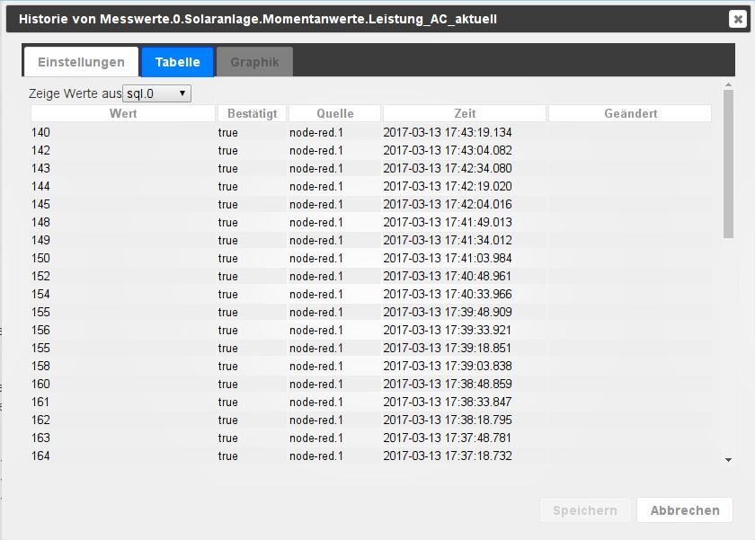

# History

Der history-Adapter dient dem Logging von Datenpunkten. Er speichert in zwei Schritten: zuerst werden die Werte eines Datenpunktes im RAM zwischengespeichert und dann beim Erreichen von maxLength in das Speicherverzeichnis geschrieben.

* * *

## Konfiguration

### 

### Storage-Einstellungen

#### Speicherverzeichnis

Pfad zum Verzeichnis, in dem die History-Daten gespeichert werden. Die Angabe kann relativ zum `/iobroker-data` Verzeichnis oder absolut ( `/mnt/history` oder `D:/history` ) erfolgen.

#### Speichern Quelle vom Ereignis mit

Legt fest ob die Quelle der Datenänderung (der auslösende Adapter) mit gespeichert werden soll.

#### Speichern Ack vom Ereignis mit

Legt fest ob das "Ack-Flag" mit gespeichert werden soll.  

### Default Einstellungen für Zustände

#### Maximale Anzahl von Ereignissen in RAM

Nach dem Erreichen dieser Anzahl werden die Werte vom RAM ins Speicherverzeichnis geschoben.

#### Entprellzeit (ms)

Schutz vor zu häufigen Änderungen eines Wertes. Dies ist der Mindestabstand in Millisekunden bis wieder ein Wert geschrieben wird.

#### gleiche Werte aufzeichnen

sollen bei gleichem Wert von Zeit zu Zeit trotzdem diese (unveränderten) Werte gespeichert werden, kann hier eine Zeitspanne in Sekunden festgelegt werden, wie häufig dieses geschehen soll. Dementsprechend bedeutet die Eingabe 0, dass kein doppelter Wert gespeichert werden soll.

#### Minimale Abweichung vom letzten Wert

sollen bei ständig wechselnden Werten trotzdem diese (geänderten) Werte nicht gespeichert werden, kann hier ein Mindestwert festgelegt werden, den sich der Wert ändern muss, damit wieder ein neuer Wert gespeichert wird. Dies ist beispielsweise bei Strommesssteckdosen sinnvoll, bei dem nicht jede leichte Veränderung geloggt werden soll. Dementsprechend bedeutet die Eingabe 0, dass jeder Wert gespeichert werden soll.

#### Storage Vorhaltezeit

Legt fest, wie lange die Werte gespeichert werden sollen (unendlich, 2 Jahre, 1 Jahre, ..., 1 Tag).   

* * *

* * *

## Einstellungen für Datenpunkte

Die Einstellungen für die zu loggenden Datenpunkte werden in dem Reiter „Objekte“ bei dem entsprechenden Datenpunkt durchgeführt. [

 Dazu wählt man ganz rechts in der Spalte das Zahnradsymbol zu dem gewünschten Datenpunkt aus. Das Konfigurationsmenü öffnet sich: 

### Aktiviert

Logging des Datenpunktes aktivieren Nur Änderungen aufzeichnen: Es werden nur Werte gespeichert, wenn sich der Wert des Datenpunktes ändert. Das spart Speicherplatz.Eine sinnvolle Nutzung ergibt sich, wenn man vorher über die Filterfelder in dem Tabellenheader die Datenpunkte so filtert, dass man z.B. nur die „State“ Datenpunkte herausfiltert, um sie dann zu loggen [

1.  die Ansicht als Liste ohne Gruppierung anzeigen lassen
2.  den oder die Filterbegriffe eingeben
3.  alle gefilterten Datenpunkte zum loggen auswählen
    1.  Das Konfigurationsmenü für die Einstellungen der log-Parameter öffnet sich
4.  Das loggen für alle gefilterten Datenpunkte auf einmal aktivieren
    1.  Weitere Parameter wie „nur Änderungen“ und Vorhaltezeit für alle gefilterten Datenpunkte einheitlich auswählen
5.  Die Änderungen speichern

* * *

## **Bedienung**

Wählt man in der Titelzeile unter Historie "mit" oder "history.0" aus, werden nur noch Datenpunkte mit Logging angezeigt. [

 Ein Klick auf das Zahnradsymbol öffnet die geloggten Daten: [

 Im Reiter Table werden die Daten tabellarisch angezeigt. [

 Im Reiter Chart kann bei installiertem Rickshaw-Adapter eine Verlaufsgrafik angezeigt werden.