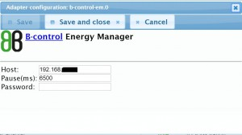

# Adapter - B-Control Energy Manager

Der Adapter dient dazu, die Geräte der Fa. [

 <u>[TQ-Systems](http://www.tq-group.com/produkte/produktdetail/prod/energy-manager/extb/Main/)</u> anstelle der vorhandenen Weboberfläche die das Gerät bietet, auch über eine JSON Schnittstelle auszulesen. Der Vorteil liegt darin, dass man die Ausleseintervalle alle Messpunkte, also sowohl der internen Sensoren als auch bis zu 8 St. Extern anschließbare Sensoren automatisiert und zyklisch auslesen kann. Baugleiche Geräte und über diesen Adapter ansprechbare Geräte sind unter anderen Markennamen von [

 <u>[Busch-Jaeger](https://www.busch-jaeger.de/produkte/produktloesungen/busch-smartenergy/busch-energymonitor/)</u> und [

 <u>[Posid](http://www.trattmann-energyexperts.de/energy-shop/?tx_trattmannshop_shop%5Bcategory%5D=5&tx_trattmannshop_shop%5Baction%5D=list&tx_trattmannshop_shop%5Bcontroller%5D=Article&cHash=095630d91afa7daafa1e7e1174562838#shop-articles)</u> am Markt erhältlich.

## Installation

Die Installation erfolgt über die Admin Oberfläche.

* * *

##  Konfiguration

[

[

  

**Host:** Die IP-Adresse des Gerätes. Diese bekommt er im Normalfall via DHCP. Da das Gerät in der Windows Netzwerkübersicht nicht sichtbar ist, muss man diese beispielsweise in der Geräteliste der angemeldeten Netzwerkgeräte im DHCP Server oder mittels eines Netzwerkscanners suchen.

**Pause(ms):** Ist die Zeit nach der der nächste Sensor ausgelesen wird.

Beispiel: Ein Standardgerät ohne externe Sensoren besteht z.B. aus 4 Messstellen. Die 3 Phasen sowie eine 4., virtuelle Messstelle Teridian_Total… die den Gesamtverbrauch anzeigt.

Eine Pause von 6500ms (Standardwert) bedeutet also, dass nach insgesamt 4x6500ms = 26 Sekunden einmal alle Sensoren ausgelesen wurden und der Zyklus von vorne beginnt.

Erste Erfahrungen haben gezeigt, dass man diesen Wert auf etwa 500ms absenken kann. Dies kann zur Ermittlung detailreicher Daten notwendig sein. Kleinere Pause Werte führen oftmals zu Dropouts in der Datenlieferung. Und auch die Belastung des ioBroker Servers kann je nach Hardwareausstattung stark ansteigen.

**Passwort:** Falls man auf dem B-Control Gerät ein Passwort eingetragen hat, ist dieses hier einzugeben. Im Standard kann dieses Feld leer bleiben.

* * *

## **Bedienung**

Eine manuelle Bedienung des Adapters findet nicht statt. Die ermittelten Datenpunkte inklusive eventuell angeschlossener Sensoren werden automatisch als Objekte mit den zugehörigen States angelegt. Auf diese kann dann von überall referenziert werden.