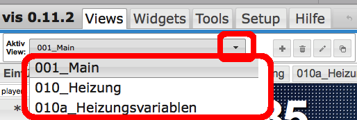
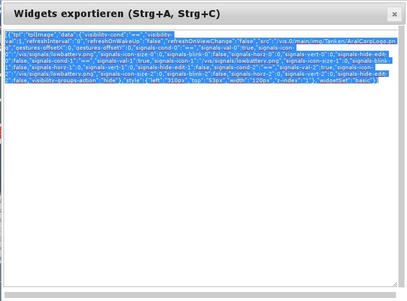
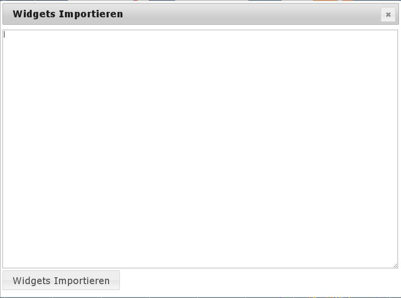
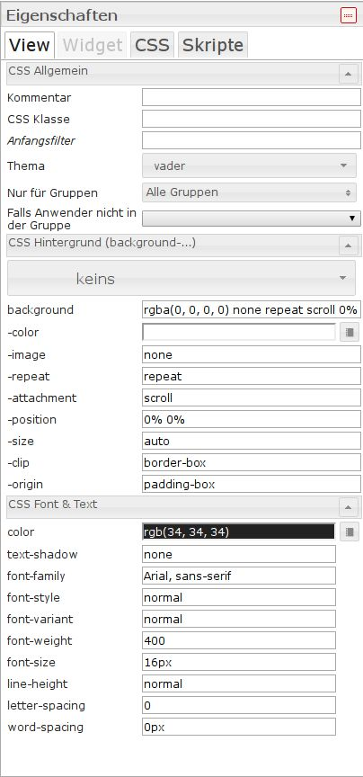
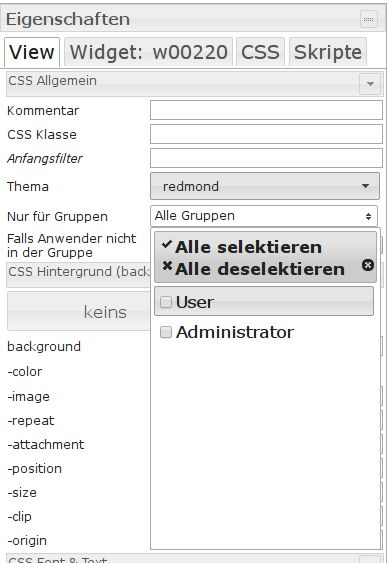
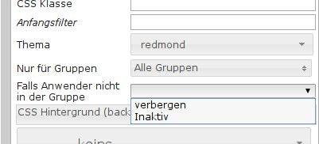
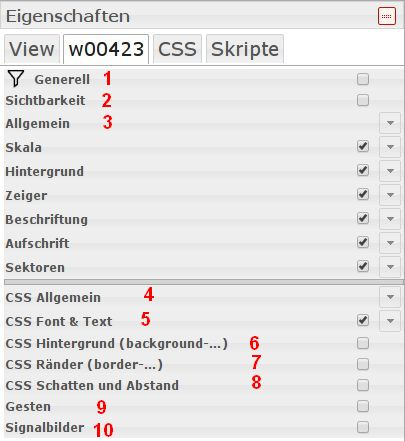
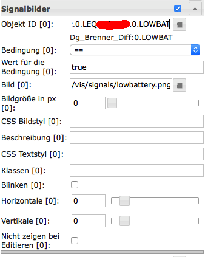
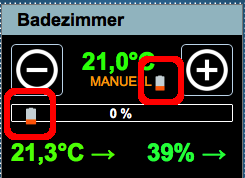
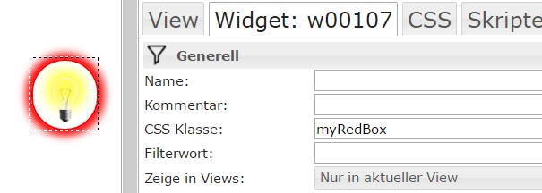

VIS ist das Visualisierungstool von ioBroker. Hier besteht die Möglichkeit eigene Bedienoberflächen anzulegen. Diese können mit Hilfe von sogenannten Widgets frei gestaltet werden. Einige Beispiele für die Möglichkeiten von VIS sind auf der [VIS-Demoseite](https://iobroker.net:8080/) zusammengefasst.

# Konfiguration

Eine Konfiguration des Adapters ist nicht nötig. Es kann nur eine VIS Instanz geben.

* * *

# Bedienung

Der Adapter wird über `<IPdesServers>:8082/vis/index.html` aufgerufen und damit die Visualisierung angezeigt. In einem [Projekt](http://www.iobroker.net/?page_id=188&lang=de&preview_id=188&preview_nonce=d845a20ee2&preview=true#Projekt) befinden sich mehrere Ansichten ([Views](http://www.iobroker.net/?page_id=5785&lang=de#views)). Auf jeder View sind wieder mehrere [Widgets](http://www.iobroker.net/?page_id=5785&lang=de#widgets) frei platzierbar, die zur Anzeige oder Bedienung dienen. Zur Erstellung und Konfiguration einer Visualisierung muss man den **Editor** laden. Der Editor wird über `<IPdesServers>:8082/vis/edit.html` oder über den Hyperlink im Reiter Instanzen des admin-Adapter aufgerufen. Nach Schließen des Editors über das Close-Window Icon ( (x) rechts oben) wird der zuletzt bearbeitete View in der Funktionsansicht dargestellt. Dieser kann jederzeit aufgerufen werden mit `<IPdesServers>:8082/vis/index.html#ViewName`

Der Editor teilt sich in verschiedene Bereiche auf. 

## Die Reiter im Kopfbereich

### Views (1)

Ist dieser Reiter angewählt, kann man in dem darunterliegenden Pulldown-Menü den zu bearbeitenden View aus den existierenden auswählen. Nach Anklicken der Arbeitsfläche wechselt die Ansicht in der Eigenschaften-Sidebar auf der rechten Seite auf den Reiter Views und zeigt die Einstellungen für die View. In der Titelleiste werden die Werkzeuge für die Bearbeitung von Views angezeigt

#### Pulldownmenü (7)

Hier kann man einen View zur Bearbeitung auswählen, bzw. der ausgewählte View wird hier angezeigt wenn man ihn über die Reiter über der Arbeitsfläche ausgewählt hat.

#### View hinzufügen (8)

Mit diesem Button kann ein neuer View hinzugefügt werden.

Im dem Fenster des ehemaligen Pulldownmenüs wird man aufgefordert einen neuen Namen einzugeben und anschließend den Vorgang über den Haken-Button abzuschließen oder mit dem ¢-Button abzubrechen.

#### View löschen (9)

Über diesen Button kann man nach vorheriger Sicherheitsabfrage den ausgewählten View löschen.

#### View umbenennen (10)

Durch Anklicken dieses Icons wird der bestehenden View umbenannt.

Das Namensfeld wechselt in den Editiermodus und man wird aufgefordert einen neuen Namen einzugeben und anschließend den Vorgang über den Haken-Button abzuschließen oder mit dem ¢-Button abzubrechen.

#### 

#### View kopieren (11)

Durch Anklicken dieses Icons wird eine Kopie des bestehenden Views angelegt.

 Das Namensfeld wechselt in den Editiermodus, zeigt den ursprünglichen View-Namen mit dem Zusatz "_new" an und man wird aufgefordert einen neuen Namen einzugeben und anschließend den Vorgang über den Haken-Button abzuschließen oder mit dem ¢-Button abzubrechen.

#### View exportieren (12)

Nach Anklicken dieses Buttons öffnet sich ein Fenster mit der Seitenbeschreibung des Views. 

 Diese Seitenbeschreibung kann als Textfile zur Sicherung benutzt werden (bitte keinen Windows-Editor benutzen, sondern z.B. Notepad++ im UNIX Modus) oder zum Import in andere Installationen.

#### View importieren (13)

Hier kann man einen View aus einer anderen Installation oder eine Sicherung im Textformat wieder einspielen. Es öffnet sich ein Fenster mit einem leeren Editorbereich. 

 In dieses Fenster wird der Inhalt des Exports kopiert, unten links im Feld _**Viewname**_ wird ein eindeutiger Name eingegeben und anschließend der dann aktive Button _**View importieren**_ geklickt. Nach kurzer Zeit ist der neue View in der Installation vorhanden.

### Widgets (2)

Wird der Reiter Widgets aktiviert ändert sich die darunterliegende Werkzeugleiste. Nach Anklicken eines Widgets wechselt die Ansicht in der Eigenschaften-Sidebar auf der rechten Seite auf den Reiter Widget und zeigt die Einstellungen für das ausgewählte Widget. Die Werkzeuge für die Bearbeitung von Widgets werden angezeigt

##### 

#### Pulldownmenü (1)

Hier kann man ein Widget zur Bearbeitung auswählen, bzw. das ausgewählte Widget wird hier angezeigt.

#### Widget löschen (2)

Mit Klick auf dieses Icon wird das ausgewählte (Bei Mehrfachauswahl alle ausgewählten) Widget nach Rückfrage gelöscht

#### Widget kopieren (3)

Nach dem Klick auf dieses icon ändert sich die Anzeige: 

 Im dem Fenster des ehemaligen Pulldownmenüs wird man aufgefordert den View einzugeben in den die Kopie des Widgets platziert werden soll und anschließend den Vorgang über den Haken-Button abzuschließen oder mit dem ¢-Button abzubrechen.

#### Widget-Informationen (4)

Wenn man auf diesen Button klickt, öffnet sich ein Fenster mit Informationen zu den Widgets. Wenn vorhanden ist der Eintrag zu dem ausgewählten Widget an oberster Stelle. 

#### Widgets ausrichten (5 - 14)

Wenn man mit gedrückter Maustaste mehrere Widgets auswählt (oder mit Ctrl-Klick) kann man anschließend mit Hilfe dieser Icons Gruppen ausrichten (linksbündig, rechtsbündig, oben bündig, unten bündig, zentriert, mittig vertikal ausgerichtet). Außerdem kann man mehrere Widgets mit gleichem Abstand (horizontal und vertikal) positionieren, sowie mit den letzten beiden Icons die Größe von mehreren Widgets anpassen. Wählt man ein Widget an, wechselt die Ansicht in der Eigenschaften-Sidebar auf der rechten Seite auf den Reiter Widget und zeigt die Einstellungen für dieses Widget. Mit der möglichen Mehrfachauswahl kann man über die rechte Sidebar die Eigenschaften mehrerer Widgets gleichzeitig verändern.

##### linksbündig (5)

Die ausgewählten Widgets werden an der linken Seite des am weitesten links liegenden Widgets vertikal ausgerichtet.

##### rechtsbündig (6)

Die ausgewählten Widgets werden an der rechten Seite des am weitesten rechts liegenden Widgets vertikal ausgerichtet.

##### oben (7)

Die ausgewählten Widgets werden an der oberen Kante des am weitesten oben liegenden Widgets horizontal ausgerichtet.

##### unten (8)

Die ausgewählten Widgets werden an der unteren Kante des am weitesten unten liegenden Widgets horizontal ausgerichtet.

##### vertikal zentrieren (9)

Die ausgewählten Widgets werden waagerecht so verschoben, dass sie vertikal zentriert ausgerichtet werden.

##### horizontal zentrieren (10)

Die ausgewählten Widgets werden senkrecht so verschoben, dass sie horizontal zentriert ausgerichtet werden.

##### horizontaler Abstand (11)

Die ausgewählten Widgets werden waagerecht so verschoben, dass sie horizontal zwischen den am weitesten links und rechts liegenden Widgets den gleichen Abstand haben.

##### vertikaler Abstand (12)

Die ausgewählten Widgets werden senkrecht so verschoben, dass sie vertikal zwischen den am weitesten oben und unten liegenden Widgets den gleichen Abstand haben.

##### gleiche Breite (13)

Die ausgewählten Widgets werden gemeinsam in der Breite verändert, dass alle Widgets die gleiche Breite haben. Bei mehreren unterschiedlichen Maßen kann man entsprechend oft klicken, und alle verfügbaren Maße werden nacheinander zur Verfügung gestellt.

##### gleiche Höhe (14)

Die ausgewählten Widgets werden gemeinsam in der Höhe verändert, dass alle Widgets die gleiche Höhe haben. Bei mehreren unterschiedlichen Maßen kann man entsprechend oft klicken, und alle verfügbaren Maße werden nacheinander zur Verfügung gestellt.

#### Alle Widgets (15 - 16)

Die beiden Widgets dienen der einfacheren Bearbeitung von Views. Das erste (15) sorgt dafür, dass die Werte der Widgets im Editor nicht aktualisiert werden, das zweite (16) verhindert das Verschieben von Widgets.

#### Widget exportieren (17)

Ist ein Widget aktiviert, kann man mit diesem Button das Widget exportieren. Nach Anklicken dieses Buttons öffnet sich ein Fenster mit der Seitenbeschreibung des Widgets. 

 Diese Seitenbeschreibung kann als Textfile zur Sicherung benutzt werden (bitte keinen Windows-Editor benutzen, sondern z.B. Notepad++ im UNIX Modus) oder zum Import in andere Installationen.

#### Widget importieren (18)

Umgekehrt kann man hier z.B. nicht im Umfang von vis enthaltene Widgets, aus einer anderen Installation oder eine Sicherung im Textformat wieder einspielen. Es öffnet sich ein Fenster mit einem leeren Editorbereich. 

 In dieses Fenster wird der Inhalt des Exports kopiert und anschließend der Button _**Widgets**** importieren**_ geklickt.

### Tools (3)

Wird der Reiter Tools aktiviert ändert sich die darunterliegende Werkzeugleiste  Die Werkzeuge für die Erleichterung der Bearbeitung von Views werden angezeigt

#### Auflösung (1)

Hier werden viele voreingestellte Bildschirmauflösungen von Mobilgeräten angezeigt, aber auch ein Punkt "Vom Anwender definiert" bietet die Möglichkeit eigene Einstellungen vorzunehmen. Wählt man hier etwas aus, wird auf der Arbeitsfläche ein Rahmen eingezeichnet, der der gewählten Bildschirmauflösung entspricht.

#### Anzeige der aktuellen Auflösung (2)

Um die aktuelle Auflösung bei einem "User defined" View angezeigt zu bekommen, kann man auf diesen Button klicken. Die Anzeige "user defined" wechselt auf die Anzeige der Größe in Breite (px) und Höhe (px). Die Werte können anschließend geändert werden.

#### Default (3)

Wenn _default_ angehakt ist, wird der aktive View zum Standardview gemacht und geladen, falls die VIS-Ansicht mit der oben eingestellten Auflösung geladen wird. **Beispiel:** Es wird die Anzeige_ iPad Portrait_ gewählt und in der View_ Start_ das Kästchen _Default_ angehakt. Angenommen, auf einem iPad wurde aus dem Projekt nun eine View mit Namen _Wetter_ im Querformat geladen. Sollte das iPad nun ins Hochformat gedreht werden, wird automatisch die vorher für diese Auflösung (Hochformat) als Standard (_default_) festgelegte View _Start_ angezeigt. So ist bei entsprechend beweglichen Geräten eine Steuerung durch Bewegung möglich (zum Beispiel "zurück zum Hauptmenü" oder _hoch_ zeigt eine andere View als _quer_).

#### immer rendern (4)

Mit dieser Checkbox wird die Funktion aktiviert bei jedem Laden des Views die Seite neu zu berechnen.

#### Gitter (5 - 6)

hier gibt es die Möglichkeiten _inaktiv_, _Elemente _und _Raster_. Wählt man Elemente, rasten die Widgets beim Bewegen mit der Maus an einem benachbarten Element ein. Bei Raster kann man noch ein Rastermaß (in px) angeben, in dem die Widgets dann einrasten.

#### Instanz ID  (7)

Hier wird eine eindeutige ID angezeigt, die sich z.B. per VIS [Control Command](https://github.com/iobroker/ioBroker.vis/blob/master/README.md#control-interface) mit einem Script ansprechen lässt.

#### Browser ID erzeugen (8)

klickt man diesen Button an, wird eine neue ID im vorigen Feld erzeugt. Dadurch ist jeder Browser auf jedem Endgerät einzeln identifizierbar.

#### für alle Anwender (9)

Wird diese Checkbox aktiviert steht dieser View allen Anwendern zur Verfügung. Wenn nicht, muss der Zugriff in der Eigenschaften-Sidebar für den View geregelt werden.

### Setup (4)

Der Reiter Setup verbirgt weitere Menüpunkte:

#### Thema (1)

Hier wird das Farbschema für den Editor ausgewählt. Es stehen _**Light**_, _**Dark**_, _**Dark-Hive**_ und _**redmond**_ zur Verfügung.

#### Sprache (2)

Die Bediensprache für den Editor kann hier festgelegt werden. Es stehen deutsch, englisch und russisch zur Verfügung. Die Sprache wird nur für aktuelles Browser-Fenster umgeschaltet. Um jetzt die Sprache dauerhaft zu ändern, sollte man das in [admin](http://post.php?post=5473)=>System config tun.

#### Projekt (3)

Projekte sind Sammlungen von [Views](http://www.iobroker.net/?page_id=1193&lang=de). Standardmäßig ist das Projekt _main_ angelegt und wird über `<IPdesServers>:8082/vis/index.html#ViewName` aufgerufen. Die Dateien des Projektes befinden sich in der ioBroker-Installation im Order `_ioBroker-Ordner_/iobroker-data/files/vis.0/main`.

###### **Anwendung**

Beim Laden eines Projektes werden alle [Views](http://www.iobroker.net/?page_id=1193&lang=de) dieses [Projektes](http://www.iobroker.net/?page_id=188&lang=de&preview_id=188&preview_nonce=d845a20ee2&preview=true#Projekt) mitgeladen. Mitunter ist das nicht sinnvoll und bremst das System. Daher kann man Views, die zusammengehören, in verschiedenen Projekten zusammenfassen. Sinnvoll ist beispielsweise ein Trennung nach Endgeräten mit verschiedenen Bildschirmauflösungen. So kann man ein Projekt _Smartphone_ anlegen und darin Views anlegen, die für Touch-Bedienung und vertikale Ausrichtung optimiert sind. Durch die bewusste Reduzierung der Widgets bleibt das Projekt klein im Datenvolumen und lädt daher auch von unterwegs (z.B. über VPN und Mobilfunk) schnell. Ein weiteres Projekt _Wandtablet_, das nur auf dem Tablet an der Wand zur Anzeige kommt, braucht keine Views aus dem Projekt _Smartphone _zu laden. Das Hauptprojekt _main_ zur Anzeige aller Daten wird gängigerweise nur vom Desktop PC aus angezeigt und editiert. Hier spielen Datenvolumen und Rechengeschwindigkeit meist keine Rolle. Sollen Views in mehreren Projekten verwendet werden, können sie mit dem Befehl [exportieren](http://www.iobroker.net/?page_id=188&lang=de&preview_id=188&preview_nonce=d845a20ee2&preview=true#exportieren)/[importieren](http://www.iobroker.net/?page_id=188&lang=de&preview_id=188&preview_nonce=d845a20ee2&preview=true#importieren) kopiert werden. Das Verlinken über Navigationswidgets von einem Projekt zum anderen ist nicht möglich. **Tipp**: Es kann auch sinnvoll sein, ein Test-Projekt anzulegen, wenn mit CSS-Anweisungen experimentiert wird.

#### Projekt-Export/Import (4)

Hier können komplette Projekte exportiert und importiert werden. Für den Export stehen die Funktionen normal und anonymisiert, in der private Daten entfernt werden, zur Verfügung. Die Vorbereitung des Exports dauert je nach Umfann ein wenig und wird anschließend als Zip-Datei im Format _**YYYY-MM-DD-ProjektName.zip **_zum Speichern angeboten.

#### neues Projekt... (5)

Hier kann ein neues Projekt angelegt werden. Ein Fenster öffnet sich und fordert die Eingabe eines Projektnamens. Nach dem Bestätigen lädt der Editor das neue Projekt unter dieser Adresse: `<IPdesServers>:8082/vis/_projektname_/index.html#ViewName.` Die Dateien des neuen Projektes befinden sich in der ioBroker Installation unter `_ioBroker-Ordner_/iobroker-data/files/vis.0/projektname`. **Tipp**: Einen Projektordner kann man duplizieren und das Duplikat im VIS Editor bearbeiten `<IPdesServers>:8082/vis/_projektname_duplikat_/index.html`.

#### Dateimanager... (6)

Nach Auswahl dieses Menüpunkts können auf bequeme Weise Dateien in das ioBroker Dateisystem hinein oder herauskopiert werden, ohne dass weitere Zusatzprogramme benötigt werden. Der Dateimanager öffnet sich:

[caption id="attachment_6007" align="aligncenter" width="799"] *Die Bilder sind nur die Beispielbilder und sind von entsprechenden Firmen urheberrechtlich geschützt.[/caption]

Das Verhalten ähnelt jedem Dateimanager. Über den blauen Button "Pfeil links" manövriert man eine Hierarchie-ebene höher, mit Klick auf einen Ordner in diesen hinein. Mit dem Icon "Ordner+" kann ein neuer Ordner erzeugt werden. Hat man das gewünschte Verzeichnis erreicht, wählt man eine Datei an, kann man sie mit dem blauen Pfeil auf den Rechner herunterladen, klickt man den grünen Pfeil an, so öffnet sich die "Dropbox".  Hier können Dateien einfach durch Drag & Drop abgelegt werden und anschließend durch Klick auf den Button _**Upload**_ auf den ioBroker Server geladen werden. Alternativ kann auch irgendwo in der Fläche geklickt werden, dann öffnet sich eine Dateiauswahl. Die Dateiliste leert sich und wenn keine weiteren Dateien hochgeladen werden sollen verlässt man die Dropbox über den Button **_Schließen_**.

#### Einstellungen... (7)

*   _**Neuladen falls keine Verbindung länger als:**_ Der aktive View wird komplett neu geladen, wenn die Verbindung zwischen Frontend (Tablet) zum Server länger als die Voreingestellte Zeit unterbrochen war. Um dies zu verhindern kann diese Zeit auch auf _**nie**_ gestellt werden.
*   _**Wiederverbindungsintervall:**_ Die Zeit in der vom Frontend versucht werden soll den Server zu erreichen
*   _**Dunkles Reconnect-Screen:**_ Üblicherweise ist die Seite weiß, wenn versucht wird den View neu zu laden. Damit dies in dunklen Räumen nicht stört, kann der Screen mit dieser Checkbox auf dunkel umgestellt werden.
*   _**Löschen aus RAM nicht aktive Views:**_ Um den wertvollen Arbeitsspeicher am Frontend, der gerade bei günstigen Tablets meist nur 1GB beträgt, zu sparen könne Views, die länger nicht mehr benötigt wurden aus dem RAM entfernt werden. Bei erneutem Laden des entsprechenden Views dauert dies dann allerdings länger. Mit dieser Option wird die Zeit eingestellt die nicht benutzte Views im RAM gehalten werden sollen.

#### Objekt-Browser... (8)

 Hier kann nach einem Objekt gesucht werden. Dieses wird nach Anklicken des Buttons _**Auswählen**_ in die Zwischenablage gelegt. Zum schnelleren Auffinden können die Filterfelder über den Spaltenköpfen verwendet werden.

### Hilfe (5)

Hier gibt es unter _Shortcuts_ eine Übersicht der Tastenbefehle und unter _über das Projekt_ eine kurze Info.

### Undo-Button (6)

Mit diesem Button kann man die letzte(n) Aktion(en schrittweise) rückgängig machen.

* * *

## Die Widget-Sidebar (14)

Sie dient der Auswahl von Widgets. Die Widgets werden als Icons dargestellt und können per drag und drop auf die Arbeitsfläche gezogen, oder mit dem Button _Einfügen_ an Position 0,0 der Arbeitsfläche positioniert werden.  Das Feld unter dem Button **_Einfügen_** ist ein Filterfeld. Hier kann man einen Begriff eingeben um die Icons danach zu durchsuchen. Alle Icons die diesen Begriff enthalten werden angezeigt. Löscht man den letzten Filter (oder den *), erhält man eine Pulldownliste mit den möglichen Suchbegriffen. Darunter befindet sich das Auswahlfeld für die Widgetsätze. Ein Satz besteht aus mehreren zusammengehörenden Widgets. Trotz gleicher Funktion kann es ein Widget für mehrere Widgetsätze geben. So wird eine einheitliche Bedienung und Optik sichergestellt. Der Stern (*) steht für alle Widgetsätze. Beim Filtern nach Begriffen werden automatisch immer alle Widgetsätze durchsucht. Sonst bietet das Pulldownmenü jedoch auch die verschiedenen Widgetsätze als Filter an. **Standardmäßig sind nur wenige Widgetsätze installiert! **Weitere Widgetsätze können als Adapter zusätzlich installiert werden und stehen nach einem Restart des .vis-Adapters hier zur Verfügung.

* * *

## Die Arbeitsfläche (16)

Hier werden die Widgets für den View positioniert. Dies kann mit der Maus oder den Pfeiltasten geschehen. Ist der Reiter Widgets aktiv, stehen auch einige Hilfen zur Ausrichtung zur Verfügung. In den Reitern über der Arbeitsfläche werden die bisher existierenden Views alphabetisch sortiert.  Sollten bereits sehr viele Views in diesem Projekt existieren muss ggf. mit den Pfeiltasten links und rechts gescrollt werden. Über diese Reiter können die zu bewarbeitenden Views genauso ausgewählt werden wie über das Pulldownmenü links oben.

* * *

## Die Eigenschaften-Sidebar (15)

## 

hier werden alle Einstellungen für die _**Views**_ und die _**Widgets**_ über die entsprechenden Reiter eingegeben.

*   Datenpunkt Zuordnung
*   Widgetgröße
*   Schriftgröße und Farbe
*   Hintergrund
*   Rahmen, Linienfarbe, -art, -stärke

Außerdem bieten die Reiter _**CSS**_ und _**Skripte**_ fortgeschrittenen Anwendern die Möglichkeit eigene Entwicklungen einzubinden.

*   _global_: CSS Anweisungen gelten für alle Projekte
*   _Projekt_: CSS Anweisungen gelten nur für das aktuelle Projekt

### View

Unter diesem Reiter können die Eigenschaften für den ausgewählten View eingestellt werden. Wenn die Arbeitsfläche des Views angeklickt wird, wird dieser Reiter automatisch aktiviert. 

#### CSS Allgemein

##### Kommentar

In diesem Feld kann ein Kommentar zu dem angewählten View eingetragen werden.

##### CSS-Klasse

Diesem View kann eine bestimmte, bereits vorher definierte CSS-Klasse zugewiesen werden.

##### Anfangsfilter

Dieser Filterwert wird beim ersten Öffnen der Seite gesetzt. Mehr über Filter im Kapitel Filter.

Auf der Seite gibt es z.B. "Licht" und "Rollos". Wenn man für "Anfangsfilter" den Wert "Licht" auswählt, dann wird die Seite beim ersten Aufruf keine "Rollos" anzeigen.

##### Thema

In diesem Pulldownmenü kann ein Thema ausgewählt werden, in dem der ausgewählte View dargestellt werden soll. Ein Thema beinhaltet einheitliche Farbgebung und Schriftarten. In dem Pulldownmenü stehen mehrere Themes zur Verfügung. 

##### Nur für Gruppen

Soll dieser View nicht für alle Anwender zu sehen sein, kann die Sichtbarkeit auf einzelne Gruppen, die in der Benutzersteuerung angelegt wurden beschränkt werden. 

 Die entsprechenden Gruppen, die diesen View sehen sollen können über die entsprechende Checkboxen ausgewählt werden.

##### Falls Anwender nicht in der Gruppe

Hier wird das Verhalten für den View festgelegt, falls ein Anwender nicht zu einer der aktivierten Gruppen gehört. 

 Dann kann der View entweder vollständig verborgen werden, oder in der Auswahl zwar sichtbar, aber nicht anwählbar sein.

#### CSS Hintergrund

##### background

Hier kann ein eigener Ausdruck eingegeben werden, um den gewünschten Hintergrund zu erzeugen. Wird hier nichts eingegeben, sondern in den darunterliegenden Feldern die Auswahl getroffen wird in diesem Feld automatisch die Zusammenfassung der unten eingegebenen Parameter aufgeführt. Z.B. `rgba(0, 0, 0, 0) none repeat scroll 0% 0% / auto padding-box border-box`

##### -color

hier kann eine Farbe für den Hintergrund  über den colorpicker oder über eine Angabe als RGB(a) eingegeben werden. 

##### -image

Für den Hintergrund kann auch ein Bild gewählt werden. Der Pfad dazu wird hier eingetragen ???

##### -repeat

Dieser Parameter bestimmt, wie mit Hintergrundbildern verfahren werden soll, falls das Element größer als ein Hintergrundbild ist. ([mehr](https://wiki.selfhtml.org/wiki/Referenz:CSS/Eigenschaften/background-repeat))

##### -attachment

Dieser Parameter bestimmt, wie sich die Hintergrundbilder verhalten sollen, wenn das Element oder sein Inhalt bewegt wird. ([mehr](https://wiki.selfhtml.org/wiki/Referenz:CSS/Eigenschaften/background-attachment))

##### -position

Dieser Parameter bestimmt, an welcher Stelle sich die linken oberen Ecken der Hintergrundbilder befinden sollen. ([mehr](https://wiki.selfhtml.org/wiki/Referenz:CSS/Eigenschaften/background-position))

##### -size

Dieser Parameter bestimmt, an welcher Stelle sich die linken oberen Ecken der Hintergrundbilder befinden sollen. ([mehr](https://wiki.selfhtml.org/wiki/Referenz:CSS/Eigenschaften/background-size))

##### -clip

Dieser Parameter bestimmt, dass die Hintergrundeigenschaften nur für bestimmte Bereiche der Elementbox gelten. ([mehr](https://wiki.selfhtml.org/wiki/Referenz:CSS/Eigenschaften/background-clip))

##### -origin

Dieser Parameter verschiebt Ursprung für das Koordinatensystem, welches der Positionierung der Hintergrundgrafiken zugrunde liegt, für jede einzelne Hintergrundgrafik. ([mehr](https://wiki.selfhtml.org/wiki/Referenz:CSS/Eigenschaften/background-origin))

#### CSS Font & text

##### color

Mit der Eigenschaft **color** wird die Farbe der Schrift bzw. des Textvordergrundes festgelegt. ([mehr](https://wiki.selfhtml.org/wiki/Color))

##### text-shadow

Die Eigenschaft **text-shadow** ermöglicht die Darstellung von Schatten unter Texten, ohne dabei Bilder zu verwenden. ([mehr](https://wiki.selfhtml.org/wiki/Text-shadow))

##### font-family

Mithilfe der hier beschriebenen Eigenschaft **font-family** können Schriftarten anggeeben werden, ohne sich darum kümmern zu müssen, ob und wie die Schriftart beim Anwender angezeigt werden kann. Falls die angegebene Schriftart nicht angezeigt werden kann, bleibt die Angabe wirkungslos. ([mehr](https://wiki.selfhtml.org/wiki/Font-family))

##### font-style

Als Schriftstil wird die Neigung der Schrift bezeichnet, welche mit der Eigenschaft **font-style** gesteuert können. ([mehr](https://wiki.selfhtml.org/wiki/Font-style))

##### font-variant

Als besondere Schriftvariante stehen Kapitälchen (kleine Großbuchstaben) statt der kleinen Buchstaben zur Verfügung, einstellbar mit der Eigenschaft **font-variant**. ([mehr](https://wiki.selfhtml.org/wiki/Font-variant))

##### font-weight

Mit der Eigenschaft **font-weight** kann die Strichstärke (fälschlicherweise Schriftgewicht genannt) bestimmt werden. Die Strichstärke bezeichnet die Dicke und Stärke einer Schrift. ([mehr](https://wiki.selfhtml.org/wiki/Font-weight))

##### font-size

Die Eigenschaft **font-size** bestimmt den Schriftgrad, das heißt die Darstellungsgröße der Schrift. ([mehr](https://wiki.selfhtml.org/wiki/Font-size))

##### line-height

Mit der Eigenschaft **line-height** kann die Höhe der Textzeile entweder relativ zur geltenden `[font-size](https://wiki.selfhtml.org/wiki/CSS/Eigenschaften/Schriftformatierung/font-size "CSS/Eigenschaften/Schriftformatierung/font-size")`-Angabe oder als absolute Angabe definiert werden. ([mehr](https://wiki.selfhtml.org/wiki/Line-height))

##### letter-spacing

Mit der Eigenschaft **letter-spacing** kann der Abstand zwischen den Buchstaben bzw. Zeichen im Text festgelegt werden. ([mehr](https://wiki.selfhtml.org/wiki/Letter-spacing))

##### word-spacing

Mit der Eigenschaft **word-spacing** wird der Abstand zwischen Wörtern im Text bestimmt. ([mehr](https://wiki.selfhtml.org/wiki/Word-spacing))

### Widget

Um Datenpunkte anzeigen oder Aktionen durchführen zu können, muss der zu steuernde Datenpunkt dem Widget zugeordnet werden. Dieser Eintrag ist im Abschnitt _Allgemein_ zu finden.

Unter dem Reiter Widget können die Eigenschaften eines Widgets sehr umfangreich eingestellt werden. (Ein Beispiel zu dem Umfang kann man nach Anklicken der Abbildung unten bekommen)

[

Sobald ein Widget ausgewählt wurde ändert sich die Beschriftung des Reiters in die Kennung des ausgewählten Widgets.

Standardmäßig sind alle Gruppen zugeklappt und können nach vorhergehender Aktivierung der Checkbox aufgeklappt werden. Werden in den Gruppen keine Einstellungen vorgenommen gelten die Einstellungen des entsprechenden Views.

#### Generell (1)

##### Name:

Hier kann ein eindeutiger Name für dieses Widget eingegeben werden

##### Kommentar:

Hier kann eine kurze Beschreibung dazu eingegeben werden

##### CSS Klasse:

Hier kann eine zuvor definierte CSS Klasse für das Widget ausgewählt werden.

##### Filterwort

Wenn hier ein Filter eingegeben wird, werden bei der Zuordnung des Datenpunktes nur Datenpunkte angezeigt, die diesem Filter entsprechen.

##### Zeige in Views

Hier kann ausgewählt werden, ob dieses Widget nur im aktuellen View, oder in mehreren erscheinen soll.

##### Inaktiv (locked)

Ist diese Checkbox markiert, kann das Widget nicht bedient werden.

#### Sichtbarkeit (2)

Die Sichtbarkeit eines Widgets kann von dem Zustand eines Datenpunktes abhängig gemacht werden. Der die Sichtbarkeit steuernde Datenpunkt kann auch ein anderer sein, als der, der mit dem Widget verknüpft ist. 

##### Object ID

Hier wird die ID des Datenpunkts eingegeben, der die Sichtbarkeit des ausgewählten widgets steuern soll. Der Datenpunkt kann über den Button gesucht werden.

##### Bedingung

Das Widget wird sichtbar wenn die hier eingegebene Bedingung für den o.a. Datenpunkt...

##### Wert für die Bedingung

...dem hier eingebenen Wert entspricht.

##### Nur für Gruppen

Soll dieses Widget nicht für alle Anwender zu sehen sein, kann die Sichtbarkeit auf einzelne Gruppen, die in der Benutzersteuerung angelegt wurden beschränkt werden. Die entsprechenden Gruppen, die diesen View sehen sollen können über die entsprechende Checkboxen ausgewählt werden.

##### Falls Anwender nicht in der Gruppe

Hier wird das Verhalten für den View festgelegt, falls ein Anwender nicht zu einer der aktivierten Gruppen gehört. Dann kann der View entweder vollständig verborgen werden, oder in der Auswahl zwar sichtbar, aber nicht anwählbar sein.

#### Allgemein (3)

Der Abschnitt Allgemein ist für jedes Widget spezifisch und wird bei den einzelnen Widgets näher beschrieben. In diesem Abschnitt wird der gewünschte Datenpunkt in dem Feld Object ID dem Widget zugeordnet. (Bitte nicht mit dem Feld Object-ID in dem Block _Sichtbarkeit_ verwechseln!) **Die CSS Einstellungen** des Widgets finden sich in den folgenden Menüpunkten und können den eigenen Wünschen angepasst werden:

#### CSS allgemein (4)  

##### position

Elemente können durch Verwendung der Eigenschaft **position** aus dem normalen Elementfluss entfernt werden und an jede beliebige Stelle des Viewports positioniert werden. In diesem Pulldownmenü können die Optionen _nichts_ (dann müssen unten left und top ausgefüllt werden), _relativ_ oder _sticky_ ausgewählt werden. [(mehr)](https://wiki.selfhtml.org/wiki/Position)

##### display

Mit der Eigenschaft **display** wird festgelegt, welche Art von Box ein Element erzeugt. Jedes Element kann Null oder mehr Boxen erzeugen. Diese Funktion steht nach Aktivierung von relativ bzw. sticky unter dem Punkt position zur Verfügung. Die möglichen Optionen sind _nichts_ oder _inline-block. [(mehr)](https://wiki.selfhtml.org/wiki/Display)_

##### left

Abstand vom linken Rand des Views

##### top

Abstand vom oberen Rand des Views

##### width

Breite des Widgets

##### height

Höhe des Widgets

##### z-index

Angebe der Ebene, in der das Widget liegt (0= auf dem Hintergrund, positive Werte= weiter vorne, je höher der Wert)

##### overflow-x

Mit overflow-x lässt sich angeben, wie übergroßer Inhalt hinsichtlich der Breite des Elements behandelt wird.

*   **visible:** Inhalte sind sichtbar
*   **hidden:** Inhalte sind unsichtbar
*   **scroll:** Inhalte sind per Scrollbalken erreichbar
*   **auto:** browserabhängig, die meisten Browser stellen Scrollbalken zur Verfügung
*   **initial:** Verhalten wirdauf Standardwerte zurückgesetzt
*   **inherit:** Verhalten wird vom Elternelement übernommen

##### overflow-y

Mit overflow-y lässt sich angeben, wie übergroßer Inhalt hinsichtlich der Höhe des Elements behandelt wird.

##### opacity

Dieser Wert gibt die (umgekehrte) Transparenz des Widgets an. Je höher der Wert, desto massiver wird das Widget angezeigt.

#### CSS Font & Text (5)

##### color

Mit der Eigenschaft **color** wird die Farbe der Schrift bzw. des Textvordergrundes festgelegt. ([mehr](https://wiki.selfhtml.org/wiki/Color))

##### text-align

Die Eigenschaft **text-align** gibt die Orientierung des Textes innerhalb der Box an (rechtsbündig, zentriert, linksbündig...) ([mehr](https://wiki.selfhtml.org/wiki/Text-align))

##### text-shadow

Die Eigenschaft **text-shadow** ermöglicht die Darstellung von Schatten unter Texten, ohne dabei Bilder zu verwenden. ([mehr](https://wiki.selfhtml.org/wiki/Text-shadow))

##### font-family

Mithilfe der hier beschriebenen Eigenschaft **font-family** können Schriftarten anggeeben werden, ohne sich darum kümmern zu müssen, ob und wie die Schriftart beim Anwender angezeigt werden kann. Falls die angegebene Schriftart nicht angezeigt werden kann, bleibt die Angabe wirkungslos. ([mehr](https://wiki.selfhtml.org/wiki/Font-family))

##### font-style

Als Schriftstil wird die Neigung der Schrift bezeichnet, welche mit der Eigenschaft **font-style** gesteuert können. ([mehr](https://wiki.selfhtml.org/wiki/Font-style))

##### font-variant

Als besondere Schriftvariante stehen Kapitälchen (kleine Großbuchstaben) statt der kleinen Buchstaben zur Verfügung, einstellbar mit der Eigenschaft **font-variant**. ([mehr](https://wiki.selfhtml.org/wiki/Font-variant))

##### font-weight

Mit der Eigenschaft **font-weight** kann die Strichstärke (fälschlicherweise Schriftgewicht genannt) bestimmt werden. Die Strichstärke bezeichnet die Dicke und Stärke einer Schrift. ([mehr](https://wiki.selfhtml.org/wiki/Font-weight))

##### font-size

Die Eigenschaft **font-size** bestimmt den Schriftgrad, das heißt die Darstellungsgröße der Schrift. ([mehr](https://wiki.selfhtml.org/wiki/Font-size))

##### line-height

Mit der Eigenschaft **line-height** kann die Höhe der Textzeile entweder relativ zur geltenden `[font-size](https://wiki.selfhtml.org/wiki/CSS/Eigenschaften/Schriftformatierung/font-size "CSS/Eigenschaften/Schriftformatierung/font-size")`-Angabe oder als absolute Angabe definiert werden. ([mehr](https://wiki.selfhtml.org/wiki/Line-height))

##### letter-spacing

Mit der Eigenschaft **letter-spacing** kann der Abstand zwischen den Buchstaben bzw. Zeichen im Text festgelegt werden. ([mehr](https://wiki.selfhtml.org/wiki/Letter-spacing))

##### word-spacing

Mit der Eigenschaft **word-spacing** wird der Abstand zwischen Wörtern im Text bestimmt. ([mehr](https://wiki.selfhtml.org/wiki/Word-spacing))

#### CSS Hintergrund (6)

##### background

Hier kann ein eigener Ausdruck eingegeben werden, um den gewünschten Hintergrund zu erzeugen. Wird hier nichts eingegeben, sondern in den darunterliegenden Feldern die Auswahl getroffen wird in diesem Feld automatisch die Zusammenfassung der unten eingegebenen Parameter aufgeführt. Z.B. `rgba(0, 0, 0, 0) none repeat scroll 0% 0% / auto padding-box border-box`

##### -color

hier kann eine Farbe für den Hintergrund  über den colorpicker oder über eine Angabe als RGB(a) eingegeben werden. 

##### -image

Für den Hintergrund kann auch ein Bild gewählt werden. Der Pfad dazu wird hier eingetragen ???

##### -repeat

Dieser Parameter bestimmt, wie mit Hintergrundbildern verfahren werden soll, falls das Element größer als ein Hintergrundbild ist. ([mehr](https://wiki.selfhtml.org/wiki/Referenz:CSS/Eigenschaften/background-repeat))

##### -attachment

Dieser Parameter bestimmt, wie sich die Hintergrundbilder verhalten sollen, wenn das Element oder sein Inhalt bewegt wird. ([mehr](https://wiki.selfhtml.org/wiki/Referenz:CSS/Eigenschaften/background-attachment))

##### -position

Dieser Parameter bestimmt, an welcher Stelle sich die linken oberen Ecken der Hintergrundbilder befinden sollen. ([mehr](https://wiki.selfhtml.org/wiki/Referenz:CSS/Eigenschaften/background-position))

##### -size

Dieser Parameter bestimmt, an welcher Stelle sich die linken oberen Ecken der Hintergrundbilder befinden sollen. ([mehr](https://wiki.selfhtml.org/wiki/Referenz:CSS/Eigenschaften/background-size))

##### -clip

Dieser Parameter bestimmt, dass die Hintergrundeigenschaften nur für bestimmte Bereiche der Elementbox gelten. ([mehr](https://wiki.selfhtml.org/wiki/Referenz:CSS/Eigenschaften/background-clip))

##### -origin

Dieser Parameter verschiebt Ursprung für das Koordinatensystem, welches der Positionierung der Hintergrundgrafiken zugrunde liegt, für jede einzelne Hintergrundgrafik. ([mehr](https://wiki.selfhtml.org/wiki/Referenz:CSS/Eigenschaften/background-origin))

#### CSS Border (7)

##### -width

Dicke der Umrandung ([mehr](https://wiki.selfhtml.org/wiki/Referenz:CSS/Eigenschaften/border-width))

##### -style

Linienart der Umrandung ([mehr](https://wiki.selfhtml.org/wiki/Referenz:CSS/Eigenschaften/border-style))

##### -color

Farbe der Umrandung ([mehr](https://wiki.selfhtml.org/wiki/Referenz:CSS/Eigenschaften/border-color))

##### -radius

Eckenradius der Umrandung; kann höchstens die Hälfte der kürzeren Strecke des Widgets sein ([mehr](https://wiki.selfhtml.org/wiki/Referenz:CSS/Eigenschaften/border-radius))

#### CSS Schatten und Abstand (8)

##### padding

Versatz vom Rand der Widget-Box ([mehr](https://wiki.selfhtml.org/wiki/Referenz:CSS/Eigenschaften/padding))

##### padding-left

Versatz auf der linken Seite ([mehr](https://wiki.selfhtml.org/wiki/Referenz:CSS/Eigenschaften/padding-left))

##### padding-top

Versatz auf der oberen Seite ([mehr](https://wiki.selfhtml.org/wiki/Referenz:CSS/Eigenschaften/padding-top))

##### padding-right

Versatz auf der rechten Seite ([mehr](https://wiki.selfhtml.org/wiki/Referenz:CSS/Eigenschaften/padding-right))

##### padding-bottom

Versatz auf der unteren Seite ([mehr](https://wiki.selfhtml.org/wiki/Referenz:CSS/Eigenschaften/padding-bottom))

##### box-shadow

Farbe des Schattens der Widget-Box ([mehr](https://wiki.selfhtml.org/wiki/Referenz:CSS/Eigenschaften/box-shadow))

##### margin-left

Abstand zum nächsten Element auf der linken Seite ([mehr](https://wiki.selfhtml.org/wiki/Referenz:CSS/Eigenschaften/margin-left))

##### margin-top

Abstand zum nächsten Element auf der oberen Seite ([mehr](https://wiki.selfhtml.org/wiki/Referenz:CSS/Eigenschaften/margin-top))

##### margin-right

Abstand zum nächsten Element auf der rechten Seite ([mehr](https://wiki.selfhtml.org/wiki/Referenz:CSS/Eigenschaften/margin-right))

##### margin-bottom

Abstand zum nächsten Element auf der unteren Seite ([mehr](https://wiki.selfhtml.org/wiki/Referenz:CSS/Eigenschaften/margin-bottom))

#### Gesten (9)

Damit kann man fast für jedes Widget eine Aktion mit Gesten (Maus oder Touch) aktivieren.  Meist verwendete Option ist Swipe (Schieben). Um diese Option für z.B. Basic-HTML zu aktivieren sollte man ein Basic-Widget namens "_Gesture indicator_" verwenden. Im Feld "_Gestenindikator_" wird dieses Widget ausgewählt. Danach muss man eine swiping Object ID definieren. Dieser Zustand wird geändert, wenn eine Swipe-Geste auf editierten Widget (nicht _Gesture indicator_) erkannt wird.

*   _Wert_ ist ein Wert um wie viel der Zustand des Datenpunktes von dem ausgewählten Widget beim Swipen geändert wird.
*   _min/-max_ sind die Grenzwerte die das Wert nicht überschreiben wird.
*   _delta_ ist eine Pixelanzahl ab wann eine Bewegung als Swipe-Geste erkannt wird. D.h. die Maus muss sich um X Pixel bewegen um die Swipe Aktion auszulösen.

Andere Geste können ähnlich konfiguriert werden. Diese sind: Zoom mit zwei Finger; Swipe nach links, rechts, oben oder untern; Drehen; Drehen nach links oder rechts; Zoom In oder Zoom Out.

#### Signalbilder (10)

Mit Hilfe des Abschnittes "Signalbilder" kann man z.B. bei batteriebetriebenen Sensoren oder Aktoren ein kleines, frei wählbares Piktogramm anzeigen lassen, wenn die Batterie zu Neige geht (und im Homematic-Umfeld auf der CCU eine entsprechende Servicemeldung kommen würde). Pro Element sind bis zu drei Signalbilder möglich. So könnte man den Batteriestatus, den Sabotagekontakt und den UNREACH-Datenpunkt (= nicht erreichbar) eines Sensors oder Aktors abfragen. 

##### Objekt ID

Hier wird der den zu überwachenden Datenpunkt eingetragen - in diesem Beispiel den LOWBAT-Datenpunkt eines Homematic-Temperatur-Differenzsensors.

##### Bedingung

Hier kann man aus den klassischen Vergleichsoperatoren (==, <, >, usw.) auswählen.

##### Wert für die Bedingung

Hier wird der Vergleichswert für den Datenpunkt angegeben - im Beispiel wird der LOWBAT-Datenpunkt mit dem Wert "true" verglichen, was eine Batteriewarnung bedeutet.

##### Bild

Ist die Vergleichsbedingung erfüllt, wird das hier angegebene Symbol angezeigt - im Beispiel eben ein Symbol, welches die leere Batterie darstellt.

##### Bildgröße in px

Hier kann die Größe des anzuzeigenden Symbols festgelegt werden.

##### CSS Bildstyle

Hier können separate CSS-Vorgaben für das Symbol eintragen werden.

##### Beschreibung

Hier kann eine Beschreibung für die Aktion hinterlegt werden.

##### CSS Textstyle

Hier können separate CSS-Vorgaben für den Text eingetragen werden.

##### Blinken

Mit dieser Checkbox wird festgelegt, ob das Symbol blinkend angezeigt werden soll, oder nicht.

##### Horizontale

Über diesen Schieberegler (oder Eingabefelder) kann horizontale Verschiebung des Symbols relativ zum Eckpunkt des eigentlichen Widgets definiert werden.

##### Vertikale

Über diesen Schieberegler (oder Eingabefelder) kann horizontale Verschiebung des Symbols relativ zum Eckpunkt des eigentlichen Widgets definiert werden.

##### Nicht zeigen bei Editieren

Ist diese Checkbox aktiv wird das Signalbild im Editor nicht angezeigt. Als Beispiel hier die Heizungssteuerung eines Badezimmers.

 Das obere Batterie-Symbol gehört zum (Homematic) Raum-Thermostat und das untere zum (Homematic) Heizkörperventil. Sobald bei einem der beiden Geräte eine LOWBAT-Meldung kommt, wird an der jeweiligen Position das Batterie-Symbol angezeigt.

### CSS

In diesen Felder kann man die CSS Klassen definieren die für dieses Projekt oder für alle Projekte gelten werden. Um diese Option zu benutzen, muss man CSS kennen und können.

*   css-Parameter
    *   _global_: CSS Anweisung gelten für alle Projekt.
    *   _Projekt_: CSS Anweisung gelten nur für das aktuelle Projekt

Man braucht Globale CSS Klassen um z.B. die Ladeseite zu umstylen. Um dies durchzuführen sollte man wissen wie CSS funktioniert. Nähere Informationen [hier](https://wiki.selfhtml.org/wiki/CSS).

Man sollte immer das Projekt CSS Feld benutzen damit sich diese Änderungen nicht auch in anderen Projekte auswirken.

Man kann damit sogar ein  eigenes jQuery Thema einfügen. ([hier](http://forum.iobroker.net/viewtopic.php?f=30&t=3549#p33050))

Die definierte CSS Klassen kann man dann für die Widgets im Feld "Generell / CSS Klasse" eintragen.

Z.B. wenn man im Feldd CSS/Projekt folgendes schreibt:

<pre class="">.myRedBox {
     border: red solid 2px;
     box-shadow: 0 0 10px 5px red;
}</pre>

Wird ein roter Schatten um jedes Widget gemalt, wenn in dem Feld CSS Klasse "myRedBox" eingetragen wird.

### Skripte

Hier kann das Standardverhalten von Widgets geändert werden. Bei dem Einsatz dieses Werkzeugs sollte der Anwender wirklich gut im CSS/Javascript/jQuery sein um es machen zu können. Dieses Skript wird zusammen mit dem View geladen.

z.B. beim Klick auf jedes Widget sollte ein Sound abgespielt werden:

<pre class="">setTimeout(function () {
    $('.vis-widget').click(function () {
       var audio = new Audio('http://download.iobroker.net/usedForVisDocumentationBell.mp3');
       audio.play(); 
    });
}, 2000);</pre>