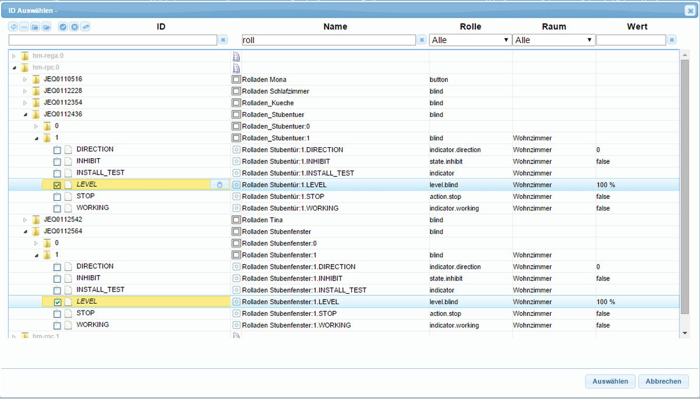

# Szenen-Adapter

Der Adapter dient dazu mehrere Geräte auf einmal zu steuern.

So kann z.B. eine Szene "Kino" angelegt werden, in der über den Harmony-Hub alle notwendigen Geräte angeschaltet, das Licht gedimmt und die Leseleuchte angeschaltet wird, wenn die Leinwand heruntergefahren wird.

Es können auch so genannte Gruppen eingerichtet werden, bei denen für jede Szene zwei verschiedene Zustände der verbundenen Datenpunkte definiert werden, je nachdem ob die Szene auf wahr oder auf falsch gesetzt ist.

## **Konfiguration:**

 Eine Konfiguration ist nicht nötig

## **Bedienung:**

Der Adapter wird über einen eigenen Reiter im admin aufgerufen.

Die Erstellung einer Szene erfolgt in 3 Schritten

#### **Schritt 1 - Erstellung der Szene**

Dazu wird auf das Plus (+) links oben in dem Szenen-Fenster geklickt [1].

Es erscheint eine neue Zeile mit Defaulteinträgen für jede Spalte

### **Schritt 2 - Konfiguration der Szene**

Jetzt wird auf das Konfigurations-Icon (Buch) in dieser Zeile geklickt [2]. Ein Konfigurationsfenster öffnet sich:

**Aktiviert:** Ist die Checkbox angehakt wird diese Szene ausgeführt

**Engine:**

**Name:** Hier wird der Szene ein Name vergeben, der in ioBroker weiterverwendet wird

**Beschreibung:** Hier kann man eine ausfühlichere Beschreibung der Szene eintragen

**Intervall zwischen den Befehlen:** damit Befehle in der richtigen Reihenfolge abgearbeitet werden kann man diese in regelmäßigen Abständen starten (Wert in Millisekunden)

**Setze Werte bei False:** Ist diese Checkbox angehakt, können zu jedem eingebundenen Datenpunkt eine Aktion bei true und eine Aktion bei false eingegeben werden. Letztere Befehle werden abgearbeitet, wenn der Zustand der gesamten Szene false ist.

**Use Trigger for True:** Soll die Szene durch einen bestimmten Wert eines Datenpunktes ausgelöst werden, wird diese Checkbox angehakt und die nächsten 3 Zeilen erscheinen.

**Trigger ID:** Hier wird der Datenpunkt eingetragen, dessen Wert die Szene auslösen soll. Über den Select Button rechts [...] kann der Datenpunkt gesucht werden.

**Trigger Bedingung:** Hier wird der Vergleichsoperator für den Trigger eingegeben (Ist gleich / größer...)

**Trigger Wert:** Der Wert, den der Datenpunkt haben muss, um die Szene zu starten (Hier: Die Leinwand fähr herab und erreicht eine Höhe <80%)

**Cron für true:** Wird kein Datenpunkt zum Sterten der Szene benutzt, kann hier ein Zeitschema in Form eines [Cronjobs](https://www.stetic.com/developer/cronjob-linux-tutorial-und-crontab-syntax.html) eingegeben werden.

Ist die Checkbox _Setzen bei false _angehakt erscheint der obige Block nochmals für die Aktionen, die ausgelöst werden sollen, wenn die Szene auf false steht, bzw. durch welchen Datenpunkt die Szene auf false gesetzt werden soll. 

### **Schritt 3 - Hinzufügen der Datenpunkte einer Szene**

Anschließend werden die Datenpunkte hinzugefügt, die in dieser Szene beteiligt sein sollen Nach Anklicken des (+) ganz rechts in der Zeile der Szene erscheint eine ID Auswahlbox: [

   hier können mehrere Datenpunkte auf einmal markiert werden. Zur vereinfachten Suche kann man die Datenpunkte filtern. Anschließend kann man diese Datenpunkte noch konfigurieren (Level, On/Off) und für dynamische Szenen eine Verzögerung einbauen. Dazu klickt man auf das Konfigurations-Icon des Datenpunktes und ein Konfigurationsfenster erscheint: 

**Aktiviert:** Ist die Checkbox angehakt wird dieser Datenpunkt in der Szene verwendet

**Beschreibung:** Hier kann man eine ausfühlichere Beschreibung der Funktion des Datenpunktes eintragen

**Name:** Hier wird der Szene ein Name vergeben, der in ioBroker weiterverwendet wird

**Setze Wert bei true:** Hier wird der Wert eingegeben, der beim Start der Szene verwendet werden soll.

Ist bei der Konfiguration der Szene die Checkbox _Setzen bei false _aktiviert, erscheint bei jedem Datenpunkt ein weiteres Feld, in das der Wert eingetragen wird, den dieser Datenpunkt erhalten soll, wenn die Szene auf false gesetzt ist: 

**Aktuell:** Gibt den aktuell in diesem Datenpunkt existierenden Wert an.

**Verzögerung:** Die Zeit in Millisekunden, wann dieser Wert nach Start der Szene gesetzt werden soll.

**Stoppe andere Verzögerungen:** Ist diese Checkbox angehakt,