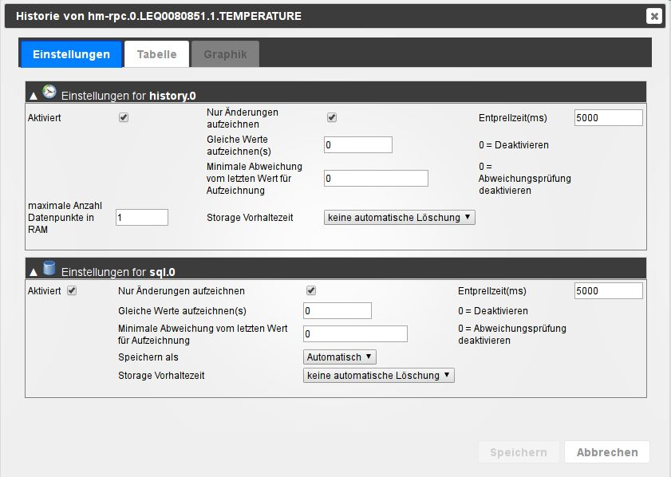
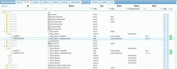
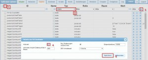
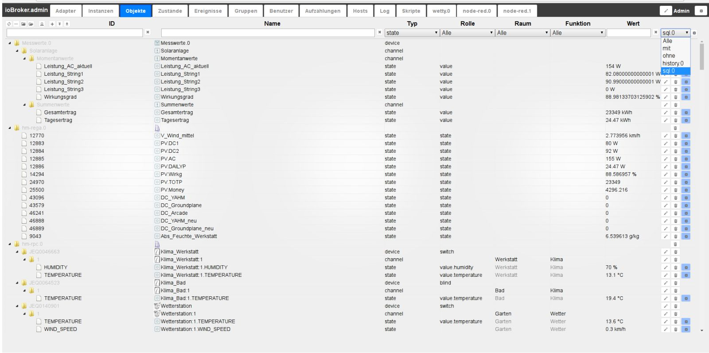
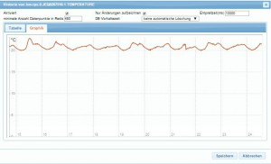

* * *

## Konfiguration

### 

### DB-Einstellungen

Hier werden die Einstellungen, die in der SQL-Datenbank des Hosts gemacht wurden um die Datenbank anzulegen eingegeben, damit der ioBroker-Server Zugriff auf die Datenbank erhält.

#### DB Typ

Hier können verschiedene Typen von SQL-Datenbanken, in die die Daten gespeichert werden sollen ausgewählt werden  SQLite ist eine Version mit reduziertem Umfang und kann gut zum Testen oder geringe Datenmengen verwendet werden. Sobald parallel Daten geschrieben und gelesen werden sollen (z.B. Flot) kann es zu Problemen kommen weil hier immer nur eins von beiden zeitgleich möglich ist.

#### Host

Hostname oder IP des Datenbank Servers.

#### Port

hier wird der Port eingegeben über den die Datenbank auf dem Host zu erreichen ist. Muss bei mySQL und MSSQL angegeben werden.

#### Datenbankname

Dieses ist der Name der Datenbank, unter dem die Daten auf dem Host gespeichert werden sollen. Muss bei mySQL und MSSQL angegeben werden.

#### Login

Der Besitzer der Datenbank (User) unter dessen ID die Daten aufgezeichnet werden sollen.

#### Passwort

Dieses ist das Passwort des angegebenen Users in der SQL-Datenbank. Zur Sicherheit muss dieses Passwort im folgenden Feld wiederholt eingegeben werden.

#### Verschlüsseln

Wird diese Checkbox angehakt werden die Daten in der SQL-Datenbank verschlüsselt hinterlegt. (Nur bei MSSQL)

#### Aufrunden auf

Angabe der Nachkommastellen mit denen Zahlen gespeichert werden sollen.

#### Parallelanfragen erlauben

Ist diese Checkbox angehakt kann von mehreren Instanzen auf diese Datenbank zugegriffen werden. Muss für SQLite deaktiviert sein, sonst normalerweise aktiv. Wenn nicht angehakt werden alle Requests immer nacheinander abgearbeitet.

### Default Einstellungen für Zustände

Diese Einstellungen geben die Werte vor, die bei der Konfiguration des Loggings der einzelnen Datenpunkte als Vorgabe genutzt werden sollen. 

#### Nur Änderungen aufzeichnen

Ist diese Checkbox angehakt müssen aufeinanderfolgende Daten unterschiedliche Werte haben damit sie aufgezeichnet werden. Sendet ein Sensor, z.B. mehrfach die gleiche Temperatur wird dies nicht aufgezeichnet, erst bei einer Änderung wird wieder eine Datensatz angelegt.

#### gleiche Werte aufzeichnen

sollen bei gleichem Wert von Zeit zu Zeit trotzdem diese (unveränderten) Werte gespeichert werden, kann hier eine Zeitspanne in Sekunden festgelegt werden, wie häufig dieses geschehen soll. Dementsprechend bedeutet die Eingabe 0, dass kein doppelter Wert gespeichert werden soll.

#### Minimale Abweichung vom letzten Wert

sollen bei ständig wechselnden Werten trotzdem diese (geänderten) Werte nicht gespeichert werden, kann hier ein Mindestwert festgelegt werden, den sich der Wert ändern muss, damit wieder ein neuer Wert gespeichert wird. Dies ist beispielsweise bei Strommesssteckdosen sinnvoll, bei dem nicht jede leichte Veränderung geloggt werden soll. Dementsprechend bedeutet die Eingabe 0, dass jeder Wert gespeichert werden soll.

#### Speichern als

Wenn nötig kann hier der Datentyp festgelegt werden mit dem die Daten gespeichert werden sollen. Dies sollte nur vor der ersten Aktivierung durchgeführt werden. 

#### Storage Vorhaltezeit

Legt fest, wie lange die Werte gespeichert werden sollen (unendlich, 2 Jahre, 1 Jahre, …, 1 Tag). 

#### Entprellzeit (ms)

Schutz vor zu häufigen Änderungen eines Wertes. Dies ist der Mindestabstand in Millisekunden bis wieder ein Wert geschrieben wird.

* * *

## Einstellungen für Datenpunkte

Die Einstellungen für die zu loggenden Datenpunkte werden in dem Reiter „Objekte“ bei dem entsprechenden Datenpunkt durchgeführt. [

 Dazu wählt man ganz rechts in der Spalte das Uhrensymbol zu dem gewünschten Datenpunkt aus. Das Konfigurationsmenü öffnet sich: 

### Aktiviert

Logging des Datenpunktes aktivieren. Eine sinnvolle Nutzung ergibt sich, wenn man vorher über die Filterfelder in dem Tabellenheader die Datenpunkte so filtert, dass man z.B. nur die „State“ Datenpunkte herausfiltert, um sie dann zu loggen [

1.  die Ansicht als Liste ohne Gruppierung anzeigen lassen
2.  den oder die Filterbegriffe eingeben
3.  alle gefilterten Datenpunkte zum loggen auswählen
    1.  Das Konfigurationsmenü für die Einstellungen der log-Parameter öffnet sich
4.  Das loggen für alle gefilterten Datenpunkte auf einmal aktivieren
    1.  Weitere Parameter wie „nur Änderungen“ und Vorhaltezeit für alle gefilterten Datenpunkte einheitlich auswählen
5.  Die Änderungen speichern

* * *

## **Bedienung**

Wählt man in der Titelzeile unter Historie "mit" oder "SQL.0" aus, werden nur noch Datenpunkte mit Logging angezeigt. [

 Ein Klick auf das Zahnradsymbol öffnet die geloggten Daten: [

 Im Reiter Table werden die Daten tabellarisch angezeigt. [

 Im Reiter Chart kann bei installiertem Rickshaw-Adapter eine Verlaufsgrafik angezeigt werden.

## Installation einer SQL-Datenbank

Die Installation einer SQL-Datenbank am Beispiel einer MariaDB auf einer Synology DiskStation kann [hier](http://www.iobroker.net/?page_id=5197&lang=de) nachgelesen werden. Eine Installation von mySQL auf einen#m Cubietruck funktioniert anlaog dazu. Zusätzlich mird noch php-myadmin benötigt.